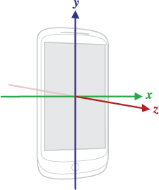

#### Class11
### Topic:Working with device sensors, Background tasks and services Assignment #4

Sensors
Use sensors on the device to add rich location and motion capabilities to your app, from GPS or network location to accelerometer, gyroscope, temperature, barometer, and more.
Sensors Overview
Most Android-powered devices have built-in sensors that measure motion, orientation, and various environmental conditions. These sensors are capable of providing raw data with high precision and accuracy, and are useful if you want to monitor three-dimensional device movement or positioning, or you want to monitor changes in the ambient environment near a device. For example, a game might track readings from a device's gravity sensor to infer complex user gestures and motions, such as tilt, shake, rotation, or swing. Likewise, a weather application might use a device's temperature sensor and humidity sensor to calculate and report the dewpoint, or a travel application might use the geomagnetic field sensor and accelerometer to report a compass bearing.

Refer to the following related resources:

Sensors
Motion Sensors
Position Sensors
Environment Sensors
API Demos (OS - RotationVectorDemo)
The Android platform supports three broad categories of sensors:

Motion sensors
These sensors measure acceleration forces and rotational forces along three axes. This category includes accelerometers, gravity sensors, gyroscopes, and rotational vector sensors.

Environmental sensors
These sensors measure various environmental parameters, such as ambient air temperature and pressure, illumination, and humidity. This category includes barometers, photometers, and thermometers.

Position sensors
These sensors measure the physical position of a device. This category includes orientation sensors and magnetometers.

You can access sensors available on the device and acquire raw sensor data by using the Android sensor framework. The sensor framework provides several classes and interfaces that help you perform a wide variety of sensor-related tasks. For example, you can use the sensor framework to do the following:

Determine which sensors are available on a device.
Determine an individual sensor's capabilities, such as its maximum range, manufacturer, power requirements, and resolution.
Acquire raw sensor data and define the minimum rate at which you acquire sensor data.
Register and unregister sensor event listeners that monitor sensor changes.
This topic provides an overview of the sensors that are available on the Android platform. It also provides an introduction to the sensor framework.

Introduction to Sensors
The Android sensor framework lets you access many types of sensors. Some of these sensors are hardware-based and some are software-based. Hardware-based sensors are physical components built into a handset or tablet device. They derive their data by directly measuring specific environmental properties, such as acceleration, geomagnetic field strength, or angular change. Software-based sensors are not physical devices, although they mimic hardware-based sensors. Software-based sensors derive their data from one or more of the hardware-based sensors and are sometimes called virtual sensors or synthetic sensors. The linear acceleration sensor and the gravity sensor are examples of software-based sensors. Table 1 summarizes the sensors that are supported by the Android platform.

Few Android-powered devices have every type of sensor. For example, most handset devices and tablets have an accelerometer and a magnetometer, but fewer devices have barometers or thermometers. Also, a device can have more than one sensor of a given type. For example, a device can have two gravity sensors, each one having a different range.

Table 1. Sensor types supported by the Android platform.

Sensor	Type	Description	Common Uses
TYPE_ACCELEROMETER	Hardware	Measures the acceleration force in m/s2 that is applied to a device on all three physical axes (x, y, and z), including the force of gravity.	Motion detection (shake, tilt, etc.).
TYPE_AMBIENT_TEMPERATURE	Hardware	Measures the ambient room temperature in degrees Celsius (°C). See note below.	Monitoring air temperatures.
TYPE_GRAVITY	Software or Hardware	Measures the force of gravity in m/s2 that is applied to a device on all three physical axes (x, y, z).	Motion detection (shake, tilt, etc.).
TYPE_GYROSCOPE	Hardware	Measures a device's rate of rotation in rad/s around each of the three physical axes (x, y, and z).	Rotation detection (spin, turn, etc.).
TYPE_LIGHT	Hardware	Measures the ambient light level (illumination) in lx.	Controlling screen brightness.
TYPE_LINEAR_ACCELERATION	Software or Hardware	Measures the acceleration force in m/s2 that is applied to a device on all three physical axes (x, y, and z), excluding the force of gravity.	Monitoring acceleration along a single axis.
TYPE_MAGNETIC_FIELD	Hardware	Measures the ambient geomagnetic field for all three physical axes (x, y, z) in μT.	Creating a compass.
TYPE_ORIENTATION	Software	Measures degrees of rotation that a device makes around all three physical axes (x, y, z). As of API level 3 you can obtain the inclination matrix and rotation matrix for a device by using the gravity sensor and the geomagnetic field sensor in conjunction with the getRotationMatrix() method.	Determining device position.
TYPE_PRESSURE	Hardware	Measures the ambient air pressure in hPa or mbar.	Monitoring air pressure changes.
TYPE_PROXIMITY	Hardware	Measures the proximity of an object in cm relative to the view screen of a device. This sensor is typically used to determine whether a handset is being held up to a person's ear.	Phone position during a call.
TYPE_RELATIVE_HUMIDITY	Hardware	Measures the relative ambient humidity in percent (%).	Monitoring dewpoint, absolute, and relative humidity.
TYPE_ROTATION_VECTOR	Software or Hardware	Measures the orientation of a device by providing the three elements of the device's rotation vector.	Motion detection and rotation detection.
TYPE_TEMPERATURE	Hardware	Measures the temperature of the device in degrees Celsius (°C). This sensor implementation varies across devices and this sensor was replaced with the TYPE_AMBIENT_TEMPERATURE sensor in API Level 14	Monitoring temperatures.
Sensor Framework
You can access these sensors and acquire raw sensor data by using the Android sensor framework. The sensor framework is part of the android.hardware package and includes the following classes and interfaces:

SensorManager
You can use this class to create an instance of the sensor service. This class provides various methods for accessing and listing sensors, registering and unregistering sensor event listeners, and acquiring orientation information. This class also provides several sensor constants that are used to report sensor accuracy, set data acquisition rates, and calibrate sensors.
Sensor
You can use this class to create an instance of a specific sensor. This class provides various methods that let you determine a sensor's capabilities.
SensorEvent
The system uses this class to create a sensor event object, which provides information about a sensor event. A sensor event object includes the following information: the raw sensor data, the type of sensor that generated the event, the accuracy of the data, and the timestamp for the event.
SensorEventListener
You can use this interface to create two callback methods that receive notifications (sensor events) when sensor values change or when sensor accuracy changes.
In a typical application you use these sensor-related APIs to perform two basic tasks:

Identifying sensors and sensor capabilities
Identifying sensors and sensor capabilities at runtime is useful if your application has features that rely on specific sensor types or capabilities. For example, you may want to identify all of the sensors that are present on a device and disable any application features that rely on sensors that are not present. Likewise, you may want to identify all of the sensors of a given type so you can choose the sensor implementation that has the optimum performance for your application.

Monitor sensor events
Monitoring sensor events is how you acquire raw sensor data. A sensor event occurs every time a sensor detects a change in the parameters it is measuring. A sensor event provides you with four pieces of information: the name of the sensor that triggered the event, the timestamp for the event, the accuracy of the event, and the raw sensor data that triggered the event.

Sensor Availability
While sensor availability varies from device to device, it can also vary between Android versions. This is because the Android sensors have been introduced over the course of several platform releases. For example, many sensors were introduced in Android 1.5 (API Level 3), but some were not implemented and were not available for use until Android 2.3 (API Level 9). Likewise, several sensors were introduced in Android 2.3 (API Level 9) and Android 4.0 (API Level 14). Two sensors have been deprecated and replaced by newer, better sensors.

Table 2 summarizes the availability of each sensor on a platform-by-platform basis. Only four platforms are listed because those are the platforms that involved sensor changes. Sensors that are listed as deprecated are still available on subsequent platforms (provided the sensor is present on a device), which is in line with Android's forward compatibility policy.

Table 2. Sensor availability by platform.

Sensor	Android 4.0
(API Level 14)	Android 2.3
(API Level 9)	Android 2.2
(API Level 8)	Android 1.5
(API Level 3)
TYPE_ACCELEROMETER	Yes	Yes	Yes	Yes
TYPE_AMBIENT_TEMPERATURE	Yes	n/a	n/a	n/a
TYPE_GRAVITY	Yes	Yes	n/a	n/a
TYPE_GYROSCOPE	Yes	Yes	n/a1	n/a1
TYPE_LIGHT	Yes	Yes	Yes	Yes
TYPE_LINEAR_ACCELERATION	Yes	Yes	n/a	n/a
TYPE_MAGNETIC_FIELD	Yes	Yes	Yes	Yes
TYPE_ORIENTATION	Yes2	Yes2	Yes2	Yes
TYPE_PRESSURE	Yes	Yes	n/a1	n/a1
TYPE_PROXIMITY	Yes	Yes	Yes	Yes
TYPE_RELATIVE_HUMIDITY	Yes	n/a	n/a	n/a
TYPE_ROTATION_VECTOR	Yes	Yes	n/a	n/a
TYPE_TEMPERATURE	Yes2	Yes	Yes	Yes
1 This sensor type was added in Android 1.5 (API Level 3), but it was not available for use until Android 2.3 (API Level 9).

2 This sensor is available, but it has been deprecated.

Identifying Sensors and Sensor Capabilities
The Android sensor framework provides several methods that make it easy for you to determine at runtime which sensors are on a device. The API also provides methods that let you determine the capabilities of each sensor, such as its maximum range, its resolution, and its power requirements.

To identify the sensors that are on a device you first need to get a reference to the sensor service. To do this, you create an instance of the SensorManager class by calling the getSystemService() method and passing in the SENSOR_SERVICE argument. For example:

KOTLIN
JAVA

private SensorManager sensorManager;
...
sensorManager = (SensorManager) getSystemService(Context.SENSOR_SERVICE);
Next, you can get a listing of every sensor on a device by calling the getSensorList() method and using the TYPE_ALL constant. For example:

KOTLIN
JAVA

List<Sensor> deviceSensors = sensorManager.getSensorList(Sensor.TYPE_ALL);
If you want to list all of the sensors of a given type, you could use another constant instead of TYPE_ALL such as TYPE_GYROSCOPE, TYPE_LINEAR_ACCELERATION, or TYPE_GRAVITY.

You can also determine whether a specific type of sensor exists on a device by using the getDefaultSensor() method and passing in the type constant for a specific sensor. If a device has more than one sensor of a given type, one of the sensors must be designated as the default sensor. If a default sensor does not exist for a given type of sensor, the method call returns null, which means the device does not have that type of sensor. For example, the following code checks whether there's a magnetometer on a device:

KOTLIN
JAVA

private SensorManager sensorManager;
...
sensorManager = (SensorManager) getSystemService(Context.SENSOR_SERVICE);
if (sensorManager.getDefaultSensor(Sensor.TYPE_MAGNETIC_FIELD) != null){
    // Success! There's a magnetometer.
} else {
    // Failure! No magnetometer.
}
Note: Android does not require device manufacturers to build any particular types of sensors into their Android-powered devices, so devices can have a wide range of sensor configurations.

In addition to listing the sensors that are on a device, you can use the public methods of the Sensor class to determine the capabilities and attributes of individual sensors. This is useful if you want your application to behave differently based on which sensors or sensor capabilities are available on a device. For example, you can use the getResolution() and getMaximumRange() methods to obtain a sensor's resolution and maximum range of measurement. You can also use the getPower() method to obtain a sensor's power requirements.

Two of the public methods are particularly useful if you want to optimize your application for different manufacturer's sensors or different versions of a sensor. For example, if your application needs to monitor user gestures such as tilt and shake, you could create one set of data filtering rules and optimizations for newer devices that have a specific vendor's gravity sensor, and another set of data filtering rules and optimizations for devices that do not have a gravity sensor and have only an accelerometer. The following code sample shows you how you can use the getVendor() and getVersion() methods to do this. In this sample, we're looking for a gravity sensor that lists Google LLC as the vendor and has a version number of 3. If that particular sensor is not present on the device, we try to use the accelerometer.

KOTLIN
JAVA

private SensorManager sensorManager;
private Sensor mSensor;

...

sensorManager = (SensorManager) getSystemService(Context.SENSOR_SERVICE);
mSensor = null;

if (sensorManager.getDefaultSensor(Sensor.TYPE_GRAVITY) != null){
    List<Sensor> gravSensors = sensorManager.getSensorList(Sensor.TYPE_GRAVITY);
    for(int i=0; i<gravSensors.size(); i++) {
        if ((gravSensors.get(i).getVendor().contains("Google LLC")) &&
           (gravSensors.get(i).getVersion() == 3)){
            // Use the version 3 gravity sensor.
            mSensor = gravSensors.get(i);
        }
    }
}
if (mSensor == null){
    // Use the accelerometer.
    if (sensorManager.getDefaultSensor(Sensor.TYPE_ACCELEROMETER) != null){
        mSensor = sensorManager.getDefaultSensor(Sensor.TYPE_ACCELEROMETER);
    } else{
        // Sorry, there are no accelerometers on your device.
        // You can't play this game.
    }
}
Another useful method is the getMinDelay() method, which returns the minimum time interval (in microseconds) a sensor can use to sense data. Any sensor that returns a non-zero value for the getMinDelay() method is a streaming sensor. Streaming sensors sense data at regular intervals and were introduced in Android 2.3 (API Level 9). If a sensor returns zero when you call the getMinDelay() method, it means the sensor is not a streaming sensor because it reports data only when there is a change in the parameters it is sensing.

The getMinDelay() method is useful because it lets you determine the maximum rate at which a sensor can acquire data. If certain features in your application require high data acquisition rates or a streaming sensor, you can use this method to determine whether a sensor meets those requirements and then enable or disable the relevant features in your application accordingly.

Caution: A sensor's maximum data acquisition rate is not necessarily the rate at which the sensor framework delivers sensor data to your application. The sensor framework reports data through sensor events, and several factors influence the rate at which your application receives sensor events. For more information, see Monitoring Sensor Events.

Monitoring Sensor Events
To monitor raw sensor data you need to implement two callback methods that are exposed through the SensorEventListener interface: onAccuracyChanged() and onSensorChanged(). The Android system calls these methods whenever the following occurs:

A sensor's accuracy changes.
In this case the system invokes the onAccuracyChanged() method, providing you with a reference to the Sensor object that changed and the new accuracy of the sensor. Accuracy is represented by one of four status constants: SENSOR_STATUS_ACCURACY_LOW, SENSOR_STATUS_ACCURACY_MEDIUM, SENSOR_STATUS_ACCURACY_HIGH, or SENSOR_STATUS_UNRELIABLE.

A sensor reports a new value.
In this case the system invokes the onSensorChanged() method, providing you with a SensorEvent object. A SensorEvent object contains information about the new sensor data, including: the accuracy of the data, the sensor that generated the data, the timestamp at which the data was generated, and the new data that the sensor recorded.

The following code shows how to use the onSensorChanged() method to monitor data from the light sensor. This example displays the raw sensor data in a TextView that is defined in the main.xml file as sensor_data.

KOTLIN
JAVA

public class SensorActivity extends Activity implements SensorEventListener {
    private SensorManager sensorManager;
    private Sensor mLight;

    @Override
    public final void onCreate(Bundle savedInstanceState) {
        super.onCreate(savedInstanceState);
        setContentView(R.layout.main);

        sensorManager = (SensorManager) getSystemService(Context.SENSOR_SERVICE);
        mLight = sensorManager.getDefaultSensor(Sensor.TYPE_LIGHT);
    }

    @Override
    public final void onAccuracyChanged(Sensor sensor, int accuracy) {
        // Do something here if sensor accuracy changes.
    }

    @Override
    public final void onSensorChanged(SensorEvent event) {
        // The light sensor returns a single value.
        // Many sensors return 3 values, one for each axis.
        float lux = event.values[0];
        // Do something with this sensor value.
    }

    @Override
    protected void onResume() {
        super.onResume();
        sensorManager.registerListener(this, mLight, SensorManager.SENSOR_DELAY_NORMAL);
    }

    @Override
    protected void onPause() {
        super.onPause();
        sensorManager.unregisterListener(this);
    }
}
In this example, the default data delay (SENSOR_DELAY_NORMAL) is specified when the registerListener() method is invoked. The data delay (or sampling rate) controls the interval at which sensor events are sent to your application via the onSensorChanged() callback method. The default data delay is suitable for monitoring typical screen orientation changes and uses a delay of 200,000 microseconds. You can specify other data delays, such as SENSOR_DELAY_GAME (20,000 microsecond delay), SENSOR_DELAY_UI (60,000 microsecond delay), or SENSOR_DELAY_FASTEST (0 microsecond delay). As of Android 3.0 (API Level 11) you can also specify the delay as an absolute value (in microseconds).

The delay that you specify is only a suggested delay. The Android system and other applications can alter this delay. As a best practice, you should specify the largest delay that you can because the system typically uses a smaller delay than the one you specify (that is, you should choose the slowest sampling rate that still meets the needs of your application). Using a larger delay imposes a lower load on the processor and therefore uses less power.

There is no public method for determining the rate at which the sensor framework is sending sensor events to your application; however, you can use the timestamps that are associated with each sensor event to calculate the sampling rate over several events. You should not have to change the sampling rate (delay) once you set it. If for some reason you do need to change the delay, you will have to unregister and reregister the sensor listener.

It's also important to note that this example uses the onResume() and onPause() callback methods to register and unregister the sensor event listener. As a best practice you should always disable sensors you don't need, especially when your activity is paused. Failing to do so can drain the battery in just a few hours because some sensors have substantial power requirements and can use up battery power quickly. The system will not disable sensors automatically when the screen turns off.

Handling Different Sensor Configurations
Android does not specify a standard sensor configuration for devices, which means device manufacturers can incorporate any sensor configuration that they want into their Android-powered devices. As a result, devices can include a variety of sensors in a wide range of configurations. If your application relies on a specific type of sensor, you have to ensure that the sensor is present on a device so your app can run successfully.

You have two options for ensuring that a given sensor is present on a device:

Detect sensors at runtime and enable or disable application features as appropriate.
Use Google Play filters to target devices with specific sensor configurations.
Each option is discussed in the following sections.

Detecting sensors at runtime
If your application uses a specific type of sensor, but doesn't rely on it, you can use the sensor framework to detect the sensor at runtime and then disable or enable application features as appropriate. For example, a navigation application might use the temperature sensor, pressure sensor, GPS sensor, and geomagnetic field sensor to display the temperature, barometric pressure, location, and compass bearing. If a device doesn't have a pressure sensor, you can use the sensor framework to detect the absence of the pressure sensor at runtime and then disable the portion of your application's UI that displays pressure. For example, the following code checks whether there's a pressure sensor on a device:

KOTLIN
JAVA

private SensorManager sensorManager;
...
sensorManager = (SensorManager) getSystemService(Context.SENSOR_SERVICE);
if (sensorManager.getDefaultSensor(Sensor.TYPE_PRESSURE) != null){
    // Success! There's a pressure sensor.
} else {
    // Failure! No pressure sensor.
}
Using Google Play filters to target specific sensor configurations
If you are publishing your application on Google Play you can use the <uses-feature> element in your manifest file to filter your application from devices that do not have the appropriate sensor configuration for your application. The <uses-feature> element has several hardware descriptors that let you filter applications based on the presence of specific sensors. The sensors you can list include: accelerometer, barometer, compass (geomagnetic field), gyroscope, light, and proximity. The following is an example manifest entry that filters apps that do not have an accelerometer:

<uses-feature android:name="android.hardware.sensor.accelerometer"
              android:required="true" />
If you add this element and descriptor to your application's manifest, users will see your application on Google Play only if their device has an accelerometer.

You should set the descriptor to android:required="true" only if your application relies entirely on a specific sensor. If your application uses a sensor for some functionality, but still runs without the sensor, you should list the sensor in the <uses-feature> element, but set the descriptor to android:required="false". This helps ensure that devices can install your app even if they do not have that particular sensor. This is also a project management best practice that helps you keep track of the features your application uses. Keep in mind, if your application uses a particular sensor, but still runs without the sensor, then you should detect the sensor at runtime and disable or enable application features as appropriate.

Sensor Coordinate System
In general, the sensor framework uses a standard 3-axis coordinate system to express data values. For most sensors, the coordinate system is defined relative to the device's screen when the device is held in its default orientation (see figure 1). When a device is held in its default orientation, the X axis is horizontal and points to the right, the Y axis is vertical and points up, and the Z axis points toward the outside of the screen face. In this system, coordinates behind the screen have negative Z values. This coordinate system is used by the following sensors:

Figure 1. Coordinate system (relative to a device) that's used by the Sensor API.

Acceleration sensor
Gravity sensor
Gyroscope
Linear acceleration sensor
Geomagnetic field sensor
The most important point to understand about this coordinate system is that the axes are not swapped when the device's screen orientation changes—that is, the sensor's coordinate system never changes as the device moves. This behavior is the same as the behavior of the OpenGL coordinate system.

Another point to understand is that your application must not assume that a device's natural (default) orientation is portrait. The natural orientation for many tablet devices is landscape. And the sensor coordinate system is always based on the natural orientation of a device.

Finally, if your application matches sensor data to the on-screen display, you need to use the getRotation() method to determine screen rotation, and then use the remapCoordinateSystem() method to map sensor coordinates to screen coordinates. You need to do this even if your manifest specifies portrait-only display.

Note: Some sensors and methods use a coordinate system that is relative to the world's frame of reference (as opposed to the device's frame of reference). These sensors and methods return data that represent device motion or device position relative to the earth. For more information, see the getOrientation() method, the getRotationMatrix() method, Orientation Sensor, and Rotation Vector Sensor.

Best Practices for Accessing and Using Sensors
As you design your sensor implementation, be sure to follow the guidelines that are discussed in this section. These guidelines are recommended best practices for anyone who is using the sensor framework to access sensors and acquire sensor data.

Only gather sensor data in the foreground
On devices running Android 9 (API level 28) or higher, apps running in the background have the following restrictions:

Sensors that use the continuous reporting mode, such as accelerometers and gyroscopes, don't receive events.
Sensors that use the on-change or one-shot reporting modes don't receive events.
Given these restrictions, it's best to detect sensor events either when your app is in the foreground or as part of a foreground service.

Unregister sensor listeners
Be sure to unregister a sensor's listener when you are done using the sensor or when the sensor activity pauses. If a sensor listener is registered and its activity is paused, the sensor will continue to acquire data and use battery resources unless you unregister the sensor. The following code shows how to use the onPause() method to unregister a listener:

KOTLIN
JAVA

private SensorManager sensorManager;
...
@Override
protected void onPause() {
    super.onPause();
    sensorManager.unregisterListener(this);
}
For more information, see unregisterListener(SensorEventListener).

Test with the Android Emulator
The Android Emulator includes a set of virtual sensor controls that allow you to test sensors such as accelerometer, ambient temperature, magnetometer, proximity, light, and more.

The emulator uses a connection with an Android device that is running the SdkControllerSensor app. Note that this app is available only on devices running Android 4.0 (API level 14) or higher. (If the device is running Android 4.0, it must have Revision 2 installed.) The SdkControllerSensor app monitors changes in the sensors on the device and transmits them to the emulator. The emulator is then transformed based on the new values that it receives from the sensors on your device.

You can view the source code for the SdkControllerSensor app in the following location:

$ your-android-sdk-directory/tools/apps/SdkController
To transfer data between your device and the emulator, follow these steps:

Check that USB debugging is enabled on your device.
Connect your device to your development machine using a USB cable.
Start the SdkControllerSensor app on your device.
In the app, select the sensors that you want to emulate.
Run the following adb command:

$ adb forward tcp:1968 tcp:1968
Start the emulator. You should now be able to apply transformations to the emulator by moving your device.
Note: If the movements that you make to your physical device aren't transforming the emulator, try running the adb command from step 5 again.

For more information, see the Android Emulator guide.

Don't block the onSensorChanged() method
Sensor data can change at a high rate, which means the system may call the onSensorChanged(SensorEvent) method quite often. As a best practice, you should do as little as possible within the onSensorChanged(SensorEvent) method so you don't block it. If your application requires you to do any data filtering or reduction of sensor data, you should perform that work outside of the onSensorChanged(SensorEvent) method.

Avoid using deprecated methods or sensor types
Several methods and constants have been deprecated. In particular, the TYPE_ORIENTATION sensor type has been deprecated. To get orientation data you should use the getOrientation() method instead. Likewise, the TYPE_TEMPERATURE sensor type has been deprecated. You should use the TYPE_AMBIENT_TEMPERATURE sensor type instead on devices that are running Android 4.0.

Verify sensors before you use them
Always verify that a sensor exists on a device before you attempt to acquire data from it. Don't assume that a sensor exists simply because it's a frequently-used sensor. Device manufacturers are not required to provide any particular sensors in their devices.

Choose sensor delays carefully
When you register a sensor with the registerListener() method, be sure you choose a delivery rate that is suitable for your application or use-case. Sensors can provide data at very high rates. Allowing the system to send extra data that you don't need wastes system resources and uses battery power.

Motion sensors
The Android platform provides several sensors that let you monitor the motion of a device.

The sensors' possible architectures vary by sensor type:

The gravity, linear acceleration, rotation vector, significant motion, step counter, and step detector sensors are either hardware-based or software-based.
The accelerometer and gyroscope sensors are always hardware-based.
Most Android-powered devices have an accelerometer, and many now include a gyroscope. The availability of the software-based sensors is more variable because they often rely on one or more hardware sensors to derive their data. Depending on the device, these software-based sensors can derive their data either from the accelerometer and magnetometer or from the gyroscope.

Motion sensors are useful for monitoring device movement, such as tilt, shake, rotation, or swing. The movement is usually a reflection of direct user input (for example, a user steering a car in a game or a user controlling a ball in a game), but it can also be a reflection of the physical environment in which the device is sitting (for example, moving with you while you drive your car). In the first case, you are monitoring motion relative to the device's frame of reference or your application's frame of reference; in the second case you are monitoring motion relative to the world's frame of reference. Motion sensors by themselves are not typically used to monitor device position, but they can be used with other sensors, such as the geomagnetic field sensor, to determine a device's position relative to the world's frame of reference (see Position Sensors for more information).

All of the motion sensors return multi-dimensional arrays of sensor values for each SensorEvent. For example, during a single sensor event the accelerometer returns acceleration force data for the three coordinate axes, and the gyroscope returns rate of rotation data for the three coordinate axes. These data values are returned in a float array (values) along with other SensorEvent parameters. 

Android Open Source Project sensors
The Android Open Source Project (AOSP) provides three software-based motion sensors: a gravity sensor, a linear acceleration sensor, and a rotation vector sensor. These sensors were updated in Android 4.0 and now use a device's gyroscope (in addition to other sensors) to improve stability and performance. If you want to try these sensors, you can identify them by using the getVendor() method and the getVersion() method (the vendor is Google LLC; the version number is 3). Identifying these sensors by vendor and version number is necessary because the Android system considers these three sensors to be secondary sensors. For example, if a device manufacturer provides their own gravity sensor, then the AOSP gravity sensor shows up as a secondary gravity sensor. All three of these sensors rely on a gyroscope: if a device does not have a gyroscope, these sensors do not show up and are not available for use.

Use the gravity sensor
The gravity sensor provides a three dimensional vector indicating the direction and magnitude of gravity. Typically, this sensor is used to determine the device's relative orientation in space. The following code shows you how to get an instance of the default gravity sensor:

KOTLIN
JAVA

private SensorManager sensorManager;
private Sensor sensor;
...
sensorManager = (SensorManager) getSystemService(Context.SENSOR_SERVICE);
sensor = sensorManager.getDefaultSensor(Sensor.TYPE_GRAVITY);
The units are the same as those used by the acceleration sensor (m/s2), and the coordinate system is the same as the one used by the acceleration sensor.

Note: When a device is at rest, the output of the gravity sensor should be identical to that of the accelerometer.

Use the linear accelerometer
The linear acceleration sensor provides you with a three-dimensional vector representing acceleration along each device axis, excluding gravity. You can use this value to perform gesture detection. The value can also serve as input to an inertial navigation system, which uses dead reckoning. The following code shows you how to get an instance of the default linear acceleration sensor:

KOTLIN
JAVA

private SensorManager sensorManager;
private Sensor sensor;
...
sensorManager = (SensorManager) getSystemService(Context.SENSOR_SERVICE);
sensor = sensorManager.getDefaultSensor(Sensor.TYPE_LINEAR_ACCELERATION);
Conceptually, this sensor provides you with acceleration data according to the following relationship:

linear acceleration = acceleration - acceleration due to gravity
You typically use this sensor when you want to obtain acceleration data without the influence of gravity. For example, you could use this sensor to see how fast your car is going. The linear acceleration sensor always has an offset, which you need to remove. The simplest way to do this is to build a calibration step into your application. During calibration you can ask the user to set the device on a table, and then read the offsets for all three axes. You can then subtract that offset from the acceleration sensor's direct readings to get the actual linear acceleration.

The sensor coordinate system is the same as the one used by the acceleration sensor, as are the units of measure (m/s2).

Use the rotation vector sensor
The rotation vector represents the orientation of the device as a combination of an angle and an axis, in which the device has rotated through an angle θ around an axis (x, y, or z). The following code shows you how to get an instance of the default rotation vector sensor:

KOTLIN
JAVA

private SensorManager sensorManager;
private Sensor sensor;
...
sensorManager = (SensorManager) getSystemService(Context.SENSOR_SERVICE);
sensor = sensorManager.getDefaultSensor(Sensor.TYPE_ROTATION_VECTOR);
The three elements of the rotation vector are expressed as follows:

x*sin(θ/2), y*sin(θ/2), z*sin(θ/2)
Where the magnitude of the rotation vector is equal to sin(θ/2), and the direction of the rotation vector is equal to the direction of the axis of rotation.

Figure 1. Coordinate system used by the rotation vector sensor.

The three elements of the rotation vector are equal to the last three components of a unit quaternion (cos(θ/2), x*sin(θ/2), y*sin(θ/2), z*sin(θ/2)). Elements of the rotation vector are unitless. The x, y, and z axes are defined in the same way as the acceleration sensor. The reference coordinate system is defined as a direct orthonormal basis (see figure 1). This coordinate system has the following characteristics:

X is defined as the vector product Y x Z. It is tangential to the ground at the device's current location and points approximately East.
Y is tangential to the ground at the device's current location and points toward the geomagnetic North Pole.
Z points toward the sky and is perpendicular to the ground plane.
For a sample application that shows how to use the rotation vector sensor, see RotationVectorDemo.java.

Use the significant motion sensor
The significant motion sensor triggers an event each time significant motion is detected and then it disables itself. A significant motion is a motion that might lead to a change in the user's location; for example walking, biking, or sitting in a moving car. The following code shows you how to get an instance of the default significant motion sensor and how to register an event listener:

KOTLIN
JAVA

private SensorManager sensorManager;
private Sensor sensor;
private TriggerEventListener triggerEventListener;
...
sensorManager = (SensorManager) getSystemService(Context.SENSOR_SERVICE);
sensor = sensorManager.getDefaultSensor(Sensor.TYPE_SIGNIFICANT_MOTION);

triggerEventListener = new TriggerEventListener() {
    @Override
    public void onTrigger(TriggerEvent event) {
        // Do work
    }
};

sensorManager.requestTriggerSensor(triggerEventListener, mSensor);
For more information, see TriggerEventListener.

Use the step counter sensor
The step counter sensor provides the number of steps taken by the user since the last reboot while the sensor was activated. The step counter has more latency (up to 10 seconds) but more accuracy than the step detector sensor.

Note: You must declare the ACTIVITY_RECOGNITION permission in order for your app to use this sensor on devices running Android 10 (API level 29) or higher.

The following code shows you how to get an instance of the default step counter sensor:

KOTLIN
JAVA

private SensorManager sensorManager;
private Sensor sensor;
...
sensorManager = (SensorManager) getSystemService(Context.SENSOR_SERVICE);
sensor = sensorManager.getDefaultSensor(Sensor.TYPE_STEP_COUNTER);
To preserve the battery on devices running your app, you should use the JobScheduler class to retrieve the current value from the step counter sensor at a specific interval. Although different types of apps require different sensor-reading intervals, you should make this interval as long as possible unless your app requires real-time data from the sensor.

Use the step detector sensor
The step detector sensor triggers an event each time the user takes a step. The latency is expected to be below 2 seconds.

Note: You must declare the ACTIVITY_RECOGNITION permission in order for your app to use this sensor on devices running Android 10 (API level 29) or higher.

The following code shows you how to get an instance of the default step detector sensor:

KOTLIN
JAVA

private SensorManager sensorManager;
private Sensor sensor;
...
sensorManager = (SensorManager) getSystemService(Context.SENSOR_SERVICE);
sensor = sensorManager.getDefaultSensor(Sensor.TYPE_STEP_DETECTOR);
Work with raw data
The following sensors provide your app with raw data about the linear and rotational forces being applied to the device. In order to use the values from these sensors effectively, you need to filter out factors from the environment, such as gravity. You might also need to apply a smoothing algorithm to the trend of values to reduce noise.

Use the accelerometer
An acceleration sensor measures the acceleration applied to the device, including the force of gravity. The following code shows you how to get an instance of the default acceleration sensor:

KOTLIN
JAVA

private SensorManager sensorManager;
private Sensor sensor;
  ...
sensorManager = (SensorManager) getSystemService(Context.SENSOR_SERVICE);
sensor = sensorManager.getDefaultSensor(Sensor.TYPE_ACCELEROMETER);
Conceptually, an acceleration sensor determines the acceleration that is applied to a device (Ad) by measuring the forces that are applied to the sensor itself (Fs) using the following relationship:

A_D=-(1/mass)∑F_S
However, the force of gravity is always influencing the measured acceleration according to the following relationship:

A_D=-g-(1/mass)∑F_S
For this reason, when the device is sitting on a table (and not accelerating), the accelerometer reads a magnitude of g = 9.81 m/s2. Similarly, when the device is in free fall and therefore rapidly accelerating toward the ground at 9.81 m/s2, its accelerometer reads a magnitude of g = 0 m/s2. Therefore, to measure the real acceleration of the device, the contribution of the force of gravity must be removed from the accelerometer data. This can be achieved by applying a high-pass filter. Conversely, a low-pass filter can be used to isolate the force of gravity. The following example shows how you can do this:

KOTLIN
JAVA

public void onSensorChanged(SensorEvent event){
    // In this example, alpha is calculated as t / (t + dT),
    // where t is the low-pass filter's time-constant and
    // dT is the event delivery rate.

    final float alpha = 0.8;

    // Isolate the force of gravity with the low-pass filter.
    gravity[0] = alpha * gravity[0] + (1 - alpha) * event.values[0];
    gravity[1] = alpha * gravity[1] + (1 - alpha) * event.values[1];
    gravity[2] = alpha * gravity[2] + (1 - alpha) * event.values[2];

    // Remove the gravity contribution with the high-pass filter.
    linear_acceleration[0] = event.values[0] - gravity[0];
    linear_acceleration[1] = event.values[1] - gravity[1];
    linear_acceleration[2] = event.values[2] - gravity[2];
}
Note: You can use many different techniques to filter sensor data. The code sample above uses a simple filter constant (alpha) to create a low-pass filter. This filter constant is derived from a time constant (t), which is a rough representation of the latency that the filter adds to the sensor events, and the sensor's event delivery rate (dt). The code sample uses an alpha value of 0.8 for demonstration purposes. If you use this filtering method you may need to choose a different alpha value.

Accelerometers use the standard sensor coordinate system. In practice, this means that the following conditions apply when a device is laying flat on a table in its natural orientation:

If you push the device on the left side (so it moves to the right), the x acceleration value is positive.
If you push the device on the bottom (so it moves away from you), the y acceleration value is positive.
If you push the device toward the sky with an acceleration of A m/s2, the z acceleration value is equal to A + 9.81, which corresponds to the acceleration of the device (+A m/s2) minus the force of gravity (-9.81 m/s2).
The stationary device will have an acceleration value of +9.81, which corresponds to the acceleration of the device (0 m/s2 minus the force of gravity, which is -9.81 m/s2).
In general, the accelerometer is a good sensor to use if you are monitoring device motion. Almost every Android-powered handset and tablet has an accelerometer, and it uses about 10 times less power than the other motion sensors. One drawback is that you might have to implement low-pass and high-pass filters to eliminate gravitational forces and reduce noise.

Use the gyroscope
The gyroscope measures the rate of rotation in rad/s around a device's x, y, and z axis. The following code shows you how to get an instance of the default gyroscope:

KOTLIN
JAVA

private SensorManager sensorManager;
private Sensor sensor;
...
sensorManager = (SensorManager) getSystemService(Context.SENSOR_SERVICE);
sensor = sensorManager.getDefaultSensor(Sensor.TYPE_GYROSCOPE);
The sensor's coordinate system is the same as the one used for the acceleration sensor. Rotation is positive in the counter-clockwise direction; that is, an observer looking from some positive location on the x, y or z axis at a device positioned on the origin would report positive rotation if the device appeared to be rotating counter clockwise. This is the standard mathematical definition of positive rotation and is not the same as the definition for roll that is used by the orientation sensor.

Usually, the output of the gyroscope is integrated over time to calculate a rotation describing the change of angles over the timestep. For example:

KOTLIN
JAVA

// Create a constant to convert nanoseconds to seconds.
private static final float NS2S = 1.0f / 1000000000.0f;
private final float[] deltaRotationVector = new float[4]();
private float timestamp;

public void onSensorChanged(SensorEvent event) {
    // This timestep's delta rotation to be multiplied by the current rotation
    // after computing it from the gyro sample data.
    if (timestamp != 0) {
      final float dT = (event.timestamp - timestamp) * NS2S;
      // Axis of the rotation sample, not normalized yet.
      float axisX = event.values[0];
      float axisY = event.values[1];
      float axisZ = event.values[2];

      // Calculate the angular speed of the sample
      float omegaMagnitude = sqrt(axisX*axisX + axisY*axisY + axisZ*axisZ);

      // Normalize the rotation vector if it's big enough to get the axis
      // (that is, EPSILON should represent your maximum allowable margin of error)
      if (omegaMagnitude > EPSILON) {
        axisX /= omegaMagnitude;
        axisY /= omegaMagnitude;
        axisZ /= omegaMagnitude;
      }

      // Integrate around this axis with the angular speed by the timestep
      // in order to get a delta rotation from this sample over the timestep
      // We will convert this axis-angle representation of the delta rotation
      // into a quaternion before turning it into the rotation matrix.
      float thetaOverTwo = omegaMagnitude * dT / 2.0f;
      float sinThetaOverTwo = sin(thetaOverTwo);
      float cosThetaOverTwo = cos(thetaOverTwo);
      deltaRotationVector[0] = sinThetaOverTwo * axisX;
      deltaRotationVector[1] = sinThetaOverTwo * axisY;
      deltaRotationVector[2] = sinThetaOverTwo * axisZ;
      deltaRotationVector[3] = cosThetaOverTwo;
    }
    timestamp = event.timestamp;
    float[] deltaRotationMatrix = new float[9];
    SensorManager.getRotationMatrixFromVector(deltaRotationMatrix, deltaRotationVector);
    // User code should concatenate the delta rotation we computed with the current rotation
    // in order to get the updated rotation.
    // rotationCurrent = rotationCurrent * deltaRotationMatrix;
}
Standard gyroscopes provide raw rotational data without any filtering or correction for noise and drift (bias). In practice, gyroscope noise and drift will introduce errors that need to be compensated for. You usually determine the drift (bias) and noise by monitoring other sensors, such as the gravity sensor or accelerometer.

Use the uncalibrated gyroscope
The uncalibrated gyroscope is similar to the gyroscope, except that no gyro-drift compensation is applied to the rate of rotation. Factory calibration and temperature compensation are still applied to the rate of rotation. The uncalibrated gyroscope is useful for post-processing and melding orientation data. In general, gyroscope_event.values[0] will be close to uncalibrated_gyroscope_event.values[0] - uncalibrated_gyroscope_event.values[3]. That is,

calibrated_x ~= uncalibrated_x - bias_estimate_x

Note: Uncalibrated sensors provide more raw results and may include some bias, but their measurements contain fewer jumps from corrections applied through calibration. Some applications may prefer these uncalibrated results as smoother and more reliable. For instance, if an application is attempting to conduct its own sensor fusion, introducing calibrations can actually distort results.

In addition to the rates of rotation, the uncalibrated gyroscope also provides the estimated drift around each axis. The following code shows you how to get an instance of the default uncalibrated gyroscope:

KOTLIN
JAVA

private SensorManager sensorManager;
private Sensor sensor;
...
sensorManager = (SensorManager) getSystemService(Context.SENSOR_SERVICE);
sensor = sensorManager.getDefaultSensor(Sensor.TYPE_GYROSCOPE_UNCALIBRATED);
Additional code samples
The BatchStepSensor sample further demonstrates the use of the APIs covered on this page.

Position sensors
The Android platform provides two sensors that let you determine the position of a device: the geomagnetic field sensor and the accelerometer. The Android platform also provides a sensor that lets you determine how close the face of a device is to an object (known as the proximity sensor). The geomagnetic field sensor and the proximity sensor are hardware-based. Most handset and tablet manufacturers include a geomagnetic field sensor. Likewise, handset manufacturers usually include a proximity sensor to determine when a handset is being held close to a user's face (for example, during a phone call). For determining a device's orientation, you can use the readings from the device's accelerometer and the geomagnetic field sensor.

Note: The orientation sensor was deprecated in Android 2.2 (API level 8), and the orientation sensor type was deprecated in Android 4.4W (API level 20).

Position sensors are useful for determining a device's physical position in the world's frame of reference. For example, you can use the geomagnetic field sensor in combination with the accelerometer to determine a device's position relative to the magnetic north pole. You can also use these sensors to determine a device's orientation in your application's frame of reference. Position sensors are not typically used to monitor device movement or motion, such as shake, tilt, or thrust (for more information, see Motion sensors).

The geomagnetic field sensor and accelerometer return multi-dimensional arrays of sensor values for each SensorEvent. For example, the geomagnetic field sensor provides geomagnetic field strength values for each of the three coordinate axes during a single sensor event. Likewise, the accelerometer sensor measures the acceleration applied to the device during a sensor event. For more information about the coordinate systems that are used by sensors, see Sensor coordinate systems. The proximity sensor provides a single value for each sensor event. Table 1 summarizes the position sensors that are supported on the Android platform.

Table 1. Position sensors that are supported on the Android platform.

Sensor	Sensor event data	Description	Units of measure
TYPE_GAME_ROTATION_VECTOR	SensorEvent.values[0]	Rotation vector component along the x axis (x * sin(θ/2)).	Unitless
SensorEvent.values[1]	Rotation vector component along the y axis (y * sin(θ/2)).
SensorEvent.values[2]	Rotation vector component along the z axis (z * sin(θ/2)).
TYPE_GEOMAGNETIC_ROTATION_VECTOR	SensorEvent.values[0]	Rotation vector component along the x axis (x * sin(θ/2)).	Unitless
SensorEvent.values[1]	Rotation vector component along the y axis (y * sin(θ/2)).
SensorEvent.values[2]	Rotation vector component along the z axis (z * sin(θ/2)).
TYPE_MAGNETIC_FIELD	SensorEvent.values[0]	Geomagnetic field strength along the x axis.	μT
SensorEvent.values[1]	Geomagnetic field strength along the y axis.
SensorEvent.values[2]	Geomagnetic field strength along the z axis.
TYPE_MAGNETIC_FIELD_UNCALIBRATED	SensorEvent.values[0]	Geomagnetic field strength (without hard iron calibration) along the x axis.	μT
SensorEvent.values[1]	Geomagnetic field strength (without hard iron calibration) along the y axis.
SensorEvent.values[2]	Geomagnetic field strength (without hard iron calibration) along the z axis.
SensorEvent.values[3]	Iron bias estimation along the x axis.
SensorEvent.values[4]	Iron bias estimation along the y axis.
SensorEvent.values[5]	Iron bias estimation along the z axis.
TYPE_ORIENTATION1	SensorEvent.values[0]	Azimuth (angle around the z-axis).	Degrees
SensorEvent.values[1]	Pitch (angle around the x-axis).
SensorEvent.values[2]	Roll (angle around the y-axis).
TYPE_PROXIMITY	SensorEvent.values[0]	Distance from object.2	cm
1This sensor was deprecated in Android 2.2 (API level 8), and this sensor type was deprecated in Android 4.4W (API level 20). The sensor framework provides alternate methods for acquiring device orientation, which are discussed in Compute the device's orientation.

2 Some proximity sensors provide only binary values representing near and far.

Use the game rotation vector sensor
The game rotation vector sensor is identical to the Rotation vector sensor, except it does not use the geomagnetic field. Therefore the Y axis does not point north but instead to some other reference. That reference is allowed to drift by the same order of magnitude as the gyroscope drifts around the Z axis.

Because the game rotation vector sensor does not use the magnetic field, relative rotations are more accurate, and not impacted by magnetic field changes. Use this sensor in a game if you do not care about where north is, and the normal rotation vector does not fit your needs because of its reliance on the magnetic field.

The following code shows you how to get an instance of the default game rotation vector sensor:

KOTLIN
JAVA

private SensorManager sensorManager;
private Sensor sensor;
...
sensorManager = (SensorManager) getSystemService(Context.SENSOR_SERVICE);
sensor = sensorManager.getDefaultSensor(Sensor.TYPE_GAME_ROTATION_VECTOR);
Use the geomagnetic rotation vector sensor
The geomagnetic rotation vector sensor is similar to the Rotation vector sensor, but it uses a magnetometer instead of a gyroscope. The accuracy of this sensor is lower than the normal rotation vector sensor, but the power consumption is reduced. Only use this sensor if you want to collect some rotation information in the background without draining too much battery. This sensor is most useful when used in conjunction with batching.

The following code shows you how to get an instance of the default geomagnetic rotation vector sensor:

KOTLIN
JAVA

private SensorManager sensorManager;
private Sensor sensor;
...
sensorManager = (SensorManager) getSystemService(Context.SENSOR_SERVICE);
sensor = sensorManager.getDefaultSensor(Sensor.TYPE_GEOMAGNETIC_ROTATION_VECTOR);
Compute the device's orientation
By computing a device's orientation, you can monitor the position of the device relative to the earth's frame of reference (specifically, the magnetic north pole). The following code shows you how to compute a device's orientation:

KOTLIN
JAVA

private SensorManager sensorManager;
...
// Rotation matrix based on current readings from accelerometer and magnetometer.
final float[] rotationMatrix = new float[9];
SensorManager.getRotationMatrix(rotationMatrix, null,
    accelerometerReading, magnetometerReading);

// Express the updated rotation matrix as three orientation angles.
final float[] orientationAngles = new float[3];
SensorManager.getOrientation(rotationMatrix, orientationAngles);
The system computes the orientation angles by using a device's geomagnetic field sensor in combination with the device's accelerometer. Using these two hardware sensors, the system provides data for the following three orientation angles:

Azimuth (degrees of rotation about the -z axis). This is the angle between the device's current compass direction and magnetic north. If the top edge of the device faces magnetic north, the azimuth is 0 degrees; if the top edge faces south, the azimuth is 180 degrees. Similarly, if the top edge faces east, the azimuth is 90 degrees, and if the top edge faces west, the azimuth is 270 degrees.
Pitch (degrees of rotation about the x axis). This is the angle between a plane parallel to the device's screen and a plane parallel to the ground. If you hold the device parallel to the ground with the bottom edge closest to you and tilt the top edge of the device toward the ground, the pitch angle becomes positive. Tilting in the opposite direction— moving the top edge of the device away from the ground—causes the pitch angle to become negative. The range of values is -180 degrees to 180 degrees.
Roll (degrees of rotation about the y axis). This is the angle between a plane perpendicular to the device's screen and a plane perpendicular to the ground. If you hold the device parallel to the ground with the bottom edge closest to you and tilt the left edge of the device toward the ground, the roll angle becomes positive. Tilting in the opposite direction—moving the right edge of the device toward the ground— causes the roll angle to become negative. The range of values is -90 degrees to 90 degrees.
Note:The sensor's roll definition has changed to reflect the vast majority of implementations in the geosensor ecosystem.

Note that these angles work off of a different coordinate system than the one used in aviation (for yaw, pitch, and roll). In the aviation system, the x axis is along the long side of the plane, from tail to nose.

The orientation sensor derives its data by processing the raw sensor data from the accelerometer and the geomagnetic field sensor. Because of the heavy processing that is involved, the accuracy and precision of the orientation sensor is diminished. Specifically, this sensor is reliable only when the roll angle is 0. As a result, the orientation sensor was deprecated in Android 2.2 (API level 8), and the orientation sensor type was deprecated in Android 4.4W (API level 20). Instead of using raw data from the orientation sensor, we recommend that you use the getRotationMatrix() method in conjunction with the getOrientation() method to compute orientation values, as shown in the following code sample. As part of this process, you can use the remapCoordinateSystem() method to translate the orientation values to your application's frame of reference.

KOTLIN
JAVA

public class SensorActivity extends Activity implements SensorEventListener {

    private SensorManager sensorManager;
    private final float[] accelerometerReading = new float[3];
    private final float[] magnetometerReading = new float[3];

    private final float[] rotationMatrix = new float[9];
    private final float[] orientationAngles = new float[3];

    @Override
    public void onCreate(Bundle savedInstanceState) {
        super.onCreate(savedInstanceState);
        setContentView(R.layout.main);
        sensorManager = (SensorManager) getSystemService(Context.SENSOR_SERVICE);
    }

    @Override
    public void onAccuracyChanged(Sensor sensor, int accuracy) {
        // Do something here if sensor accuracy changes.
        // You must implement this callback in your code.
    }

    @Override
    protected void onResume() {
        super.onResume();

        // Get updates from the accelerometer and magnetometer at a constant rate.
        // To make batch operations more efficient and reduce power consumption,
        // provide support for delaying updates to the application.
        //
        // In this example, the sensor reporting delay is small enough such that
        // the application receives an update before the system checks the sensor
        // readings again.
        Sensor accelerometer = sensorManager.getDefaultSensor(Sensor.TYPE_ACCELEROMETER);
        if (accelerometer != null) {
            sensorManager.registerListener(this, accelerometer,
                SensorManager.SENSOR_DELAY_NORMAL, SensorManager.SENSOR_DELAY_UI);
        }
        Sensor magneticField = sensorManager.getDefaultSensor(Sensor.TYPE_MAGNETIC_FIELD);
        if (magneticField != null) {
            sensorManager.registerListener(this, magneticField,
                SensorManager.SENSOR_DELAY_NORMAL, SensorManager.SENSOR_DELAY_UI);
        }
    }

    @Override
    protected void onPause() {
        super.onPause();

        // Don't receive any more updates from either sensor.
        sensorManager.unregisterListener(this);
    }

    // Get readings from accelerometer and magnetometer. To simplify calculations,
    // consider storing these readings as unit vectors.
    @Override
    public void onSensorChanged(SensorEvent event) {
        if (event.sensor.getType() == Sensor.TYPE_ACCELEROMETER) {
          System.arraycopy(event.values, 0, accelerometerReading,
              0, accelerometerReading.length);
        } else if (event.sensor.getType() == Sensor.TYPE_MAGNETIC_FIELD) {
            System.arraycopy(event.values, 0, magnetometerReading,
                0, magnetometerReading.length);
        }
    }

    // Compute the three orientation angles based on the most recent readings from
    // the device's accelerometer and magnetometer.
    public void updateOrientationAngles() {
        // Update rotation matrix, which is needed to update orientation angles.
        SensorManager.getRotationMatrix(rotationMatrix, null,
            accelerometerReading, magnetometerReading);

        // "rotationMatrix" now has up-to-date information.

        SensorManager.getOrientation(rotationMatrix, orientationAngles);

        // "orientationAngles" now has up-to-date information.
    }
}
You don't usually need to perform any data processing or filtering of the device's raw orientation angles other than translating the sensor's coordinate system to your application's frame of reference.

Use the geomagnetic field sensor
The geomagnetic field sensor lets you monitor changes in the earth's magnetic field. The following code shows you how to get an instance of the default geomagnetic field sensor:

KOTLIN
JAVA

private SensorManager sensorManager;
private Sensor sensor;
...
sensorManager = (SensorManager) getSystemService(Context.SENSOR_SERVICE);
sensor = sensorManager.getDefaultSensor(Sensor.TYPE_MAGNETIC_FIELD);
This sensor provides raw field strength data (in μT) for each of the three coordinate axes. Usually, you do not need to use this sensor directly. Instead, you can use the rotation vector sensor to determine raw rotational movement or you can use the accelerometer and geomagnetic field sensor in conjunction with the getRotationMatrix() method to obtain the rotation matrix and the inclination matrix. You can then use these matrices with the getOrientation() and getInclination() methods to obtain azimuth and geomagnetic inclination data.
Environment sensors
The Android platform provides four sensors that let you monitor various environmental properties. You can use these sensors to monitor relative ambient humidity, illuminance, ambient pressure, and ambient temperature near an Android-powered device. All four environment sensors are hardware-based and are available only if a device manufacturer has built them into a device. With the exception of the light sensor, which most device manufacturers use to control screen brightness, environment sensors are not always available on devices. Because of this, it's particularly important that you verify at runtime whether an environment sensor exists before you attempt to acquire data from it.

Unlike most motion sensors and position sensors, which return a multi-dimensional array of sensor values for each SensorEvent, environment sensors return a single sensor value for each data event. For example, the temperature in °C or the pressure in hPa. Also, unlike motion sensors and position sensors, which often require high-pass or low-pass filtering, environment sensors do not typically require any data filtering or data processing. Table 1 provides a summary of the environment sensors that are supported on the Android platform.

Table 1. Environment sensors that are supported on the Android platform.

Sensor	Sensor event data	Units of measure	Data description
TYPE_AMBIENT_TEMPERATURE	event.values[0]	°C	Ambient air temperature.
TYPE_LIGHT	event.values[0]	lx	Illuminance.
TYPE_PRESSURE	event.values[0]	hPa or mbar	Ambient air pressure.
TYPE_RELATIVE_HUMIDITY	event.values[0]	%	Ambient relative humidity.
TYPE_TEMPERATURE	event.values[0]	°C	Device temperature.1
1 Implementations vary from device to device. This sensor was deprecated in Android 4.0 (API Level 14).

Use the light, pressure, and temperature sensors
The raw data you acquire from the light, pressure, and temperature sensors usually requires no calibration, filtering, or modification, which makes them some of the easiest sensors to use. To acquire data from these sensors you first create an instance of the SensorManager class, which you can use to get an instance of a physical sensor. Then you register a sensor listener in the onResume() method, and start handling incoming sensor data in the onSensorChanged() callback method. The following code shows you how to do this:

KOTLIN
JAVA

public class SensorActivity extends Activity implements SensorEventListener {
    private SensorManager sensorManager;
    private Sensor pressure;

    @Override
    public final void onCreate(Bundle savedInstanceState) {
      super.onCreate(savedInstanceState);
      setContentView(R.layout.main);

      // Get an instance of the sensor service, and use that to get an instance of
      // a particular sensor.
      sensorManager = (SensorManager) getSystemService(Context.SENSOR_SERVICE);
      pressure = sensorManager.getDefaultSensor(Sensor.TYPE_PRESSURE);
    }

    @Override
    public final void onAccuracyChanged(Sensor sensor, int accuracy) {
      // Do something here if sensor accuracy changes.
    }

    @Override
    public final void onSensorChanged(SensorEvent event) {
      float millibarsOfPressure = event.values[0];
      // Do something with this sensor data.
    }

    @Override
    protected void onResume() {
      // Register a listener for the sensor.
      super.onResume();
      sensorManager.registerListener(this, pressure, SensorManager.SENSOR_DELAY_NORMAL);
    }

    @Override
    protected void onPause() {
      // Be sure to unregister the sensor when the activity pauses.
      super.onPause();
      sensorManager.unregisterListener(this);
    }
    Raw GNSS Measurements
Google has launched a new version of the GnssLogger in the Play Store with several new features.

Note: Google announced the Smartphone Decimeter Challenge at the ION GNSS+ 2021. The competition has cash prizes. Participation in the competition is open to everyone. To be eligible for prizes, participants must register for the conference, submit an extended abstract to the session "HIGH PRECISION GNSS POSITIONING ON SMARTPHONES COMPETITION" by the March 5, 2021 deadline, and present their results at the conference. Competitors wanting a peer-reviewed version of their results to appear in the conference proceedings are required to have full results and accompanying paper submitted per competition and conference guidelines by June 1, 2021 for peer review. Keep checking back for details on how to download the training datasets, including ground truth.
The Android Framework provides access to raw GNSS measurements on several Android devices.

Note: Google has released version 3.0.3.0 of the GNSS Analysis App. For more information, see the GNSS Analysis app v3.0.3.0 release notes.
You can find the tools in the GPS Measurement Tools repo on GitHub, which includes the GNSS Logger APK, the GNSS Analysis app for Linux, Windows, macOS, and the Installation and User Manual.

Note: Some versions of Linux have issues with MATLAB (throughout) 2018. If you experience an issue when starting the app on your Linux machine, see this MATLAB article for info on how to resolve it.
Original equipment manufacturers (OEMs), developers, and researchers can make use of the tools in this page to test new phone designs, validate functionality, develop new algorithms, evaluate improvements to the GNSS system implementation as well as building value added apps.

SUPL Client Sample Code
Note: Google has open-sourced SUPL client sample code that can be used to obtain ephemeris in real time.
Suplclient is sample code that accesses supl.google.com to obtain real time ephemeris. The SuplTester class provides an example on how to use the SUPL Client Project. The SuplTester sets up the SUPL TCP connection specifications, then at a given latitude and longitude sends an LPP SUPL request and prints the SUPL server response.

Antenna calibration information
Starting in Android 11 (API level 30), you can use the GnssAntennaInfo class to access antenna characteristics, such as: phase center offset (PCO) coordinates, phase center variation (PCV) corrections, and signal gain corrections. These corrections can be applied to the raw measurements to improve accuracy.

When using GnssAntennaInfo, keep the following system behaviors in mind. They are designed to enhance user privacy.

The characteristics supplied by this API are only specific to the device model, not an individual device.
Use of the GnssAntennaInfo class requires the ACCESS_FINE_LOCATION permission.
Logging raw measurements
You can use Android Studio to build an app that captures raw GNSS measurements and other location data and logs them to a file. For example source code of such an app, see GPS Measurement Tools.

Google GNSSLogger is a sample app that is developed with this functionality. To get GNSS output with the sample app, your device must support raw GNSS measurements.

Once you have captured the GNSS log using the GNSS Logger, you can copy the log files from the device to your computer for further analysis. From within the GNSS Logger you can send the files to yourself via email or save them to Google Drive. Alternatively, you can save the files using the file management app on the device, or you can use the Android Debug Bridge (ADB) as explained in Copy files to/from a device.

Analyzing raw measurements
The GNSS Analysis app reads the GPS/GNSS raw measurements collected by the GNSS Logger and uses them to analyze the GNSS receiver behavior, as shown in figure 1.

You can download the app for Linux Windows, and macOS systems, or download the Installation and User Manual.

GNSS Logger and GNSS Analysis

Figure 1. GNSS Logger collects the measurements that can be consumed by GNSS Analysis.

The GNSS Analysis app is built on MATLAB, but you don't need to have MATLAB to run it. The app is compiled into an executable that installs a copy of the MATLAB Runtime.

GNSS Analysis Control Panel
The GNSS Analysis control panel, shown in figure 2, lets you manage app features, such as:

Select which satellites are displayed.
Control the reference position, velocity, and time (PVT) used for calculating measurement errors.
Generate analysis reports.
Define a window in the data between start and end times.
GNSS Analysis Control Panel)

Figure 2. GNSS Analysis control panel

GNSS Analysis interactive plots
The GNSS Analysis app provides interactive plots organized in radio frequency (RF), clocks, and measurements columns, as shown in figure 3.

GNSS Analysis interactive plots)

Figure 3. GNSS Analysis app displaying interactive plots.

The RF column shows the following data:

For each constellation, the four satellites with the strongest signals.
For each satellite, the time plot of carrier to noise density (C/No).
The skyplot of satellite positions.
The clock column shows the following data:

The pseudoranges.
The offset frequency of the receiver clock, which is computed using one of the following reference positions:

Automatically computed mean position.
Latitude, longitude, and altitude entered by the user.
National Marine Electronics Association (NMEA) file with truth reference PVT.
Note: One of the major benefits of using raw measurements is that you can observe the receiver clock behavior with a precision of at least 1 part per billion (ppb). This is important to watch when building a device, because any heat source near the reference oscillator might cause the clock error rate to increase rapidly.
The offset of the standby clock that keeps time when the receiver resets the duty cycle of the primary oscillator.

The measurements column shows the following data:

The weighted least squares position results obtained from the raw pseudoranges. The weighting is done using the reported uncertainty of each measurement, which is part of the raw measurement API spec.
The errors of each pseudorange for each measurement.
The errors of each pseudorange rate for each measurement.

Note: A major benefit of raw measurements is that you can analyze the errors of each measurement, which provides great insight into the signal environment and receiver behavior.

