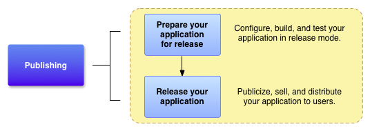
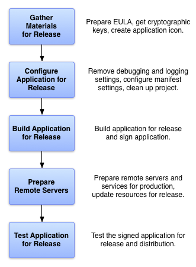
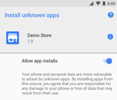

#### Class12
### Topic: Publishing and distributing applications

Publish your app
Important: In the second half of 2021, new apps will be required to publish with the Android App Bundle on Google Play. New apps larger than 150 MB must use either Play Feature Delivery or Play Asset Delivery.
Publishing is the general process that makes your Android applications available to users. When you publish an Android application you perform two main tasks:

You prepare the application for release.
During the preparation step you build a release version of your application, which users can download and install on their Android-powered devices.

You release the application to users.
During the release step you publicize, sell, and distribute the release version of your application to users.

This page provides an overview of the process you should follow as you prepare to publish your app. If you plan to publish on Google Play, you should also read the Google Play launch checklist.

Preparing your app for release
Preparing your application for release is a multi-step process that involves the following tasks:

Configuring your application for release.
At a minimum you need to remove Log calls and remove the android:debuggable attribute from your manifest file. You should also provide values for the android:versionCode and android:versionName attributes, which are located in the <manifest> element. You may also have to configure several other settings to meet Google Play requirements or accommodate whatever method you're using to release your application.

If you are using Gradle build files, you can use the release build type to set your build settings for the published version of your app.

Building and signing a release version of your application.
You can use the Gradle build files with the release build type to build and sign a release version of your application. See Building and Running from Android Studio.

Testing the release version of your application.
Before you distribute your application, you should thoroughly test the release version on at least one target handset device and one target tablet device.

Updating application resources for release.
You need to be sure that all application resources such as multimedia files and graphics are updated and included with your application or staged on the proper production servers.

Preparing remote servers and services that your application depends on.
If your application depends on external servers or services, you need to be sure they are secure and production ready.

You may have to perform several other tasks as part of the preparation process. For example, you will need to get a private key for signing your application. You will also need to create an icon for your application, and you may want to prepare an End User License Agreement (EULA) to protect your person, organization, and intellectual property.

When you are finished preparing your application for release you will have a signed .apk file that you can distribute to users.

To learn how to prepare your application for release, see Preparing for Release in the Dev Guide. This topic provides step-by-step instructions for configuring and building a release version of your application.

Releasing your app to users
You can release your Android applications several ways. Usually, you release applications through an application marketplace such as Google Play, but you can also release applications on your own website or by sending an application directly to a user.

Releasing through an app marketplace
If you want to distribute your apps to the broadest possible audience, releasing through an app marketplace such as Google Play is ideal.

Google Play is the premier marketplace for Android apps and is particularly useful if you want to distribute your applications to a large global audience. However, you can distribute your apps through any app marketplace you want or you can use multiple marketplaces.

Releasing your apps on Google Play
Google Play is a robust publishing platform that helps you publicize, sell, and distribute your Android applications to users around the world. When you release your applications through Google Play you have access to a suite of developer tools that let you analyze your sales, identify market trends, and control who your applications are being distributed to. You also have access to several revenue-enhancing features such as in-app billing and application licensing. The rich array of tools and features, coupled with numerous end-user community features, makes Google Play the premier marketplace for selling and buying Android applications.

Releasing your application on Google Play is a simple process that involves three basic steps:

Preparing promotional materials.
To fully leverage the marketing and publicity capabilities of Google Play, you need to create promotional materials for your application, such as screenshots, videos, graphics, and promotional text.

Configuring options and uploading assets.
Google Play lets you target your application to a worldwide pool of users and devices. By configuring various Google Play settings, you can choose the countries you want to reach, the listing languages you want to use, and the price you want to charge in each country. You can also configure listing details such as the application type, category, and content rating. When you are done configuring options you can upload your promotional materials and your application as a draft (unpublished) application.

Publishing the release version of your application.
If you are satisfied that your publishing settings are correctly configured and your uploaded application is ready to be released to the public, you can simply click Publish in the Play Console and within minutes your application will be live and available for download around the world.

For more information, see Google Play.

Releasing through a website
If you do not want to release your app on a marketplace like Google Play, you can make the app available for download on your own website or server, including on a private or enterprise server. To do this, you must first prepare your application for release in the normal way. Then all you need to do is host the release-ready APK file on your website and provide a download link to users.

When users browse to the download link from their Android-powered devices, the file is downloaded and Android system automatically starts installing it on the device. However, the installation process will start automatically only if the user has configured their Settings to allow the installation of apps from unknown sources.

Although it is relatively easy to release your application on your own website, it can be inefficient. For example, if you want to monetize your application you will have to process and track all financial transactions yourself and you will not be able to use Google Play's In-app Billing service to sell in-app products. In addition, you will not be able to use the Licensing service to help prevent unauthorized installation and use of your application.

User opt-in for unknown apps and sources
Android protects users from inadvertent download and install of apps from locations other than a first-party app store, such as Google Play, which is trusted. Android blocks such installs until the user opts into allowing the installation of apps from other sources. The opt-in process depends on the version of Android running on the user's device:

Screenshot showing the settings screen for accepting install of
       unknown apps from different sources.
Figure 1. The Install unknown apps system settings screen, where users grant permission for a particular source to install unknown apps.

On devices running Android 8.0 (API level 26) and higher, users must navigate to the Install unknown apps system settings screen to enable app installations from a particular source.
On devices running Android 7.1.1 (API level 25) and lower, users must either enable the Unknown sources system setting or allow a single installation of an unknown app.
Install unknown apps
On devices running Android 8.0 (API level 26) and higher, users must grant permission to install apps from a source that isn't a first-party app store. To do so, they must enable the Allow app installs setting for that source within the Install unknown apps system settings screen. Figure 1 illustrates this process.

Note: Users can change this setting for a particular source at any time. Therefore, a source that installs unknown apps should always call canRequestPackageInstalls() to check whether the user has granted that source permission to install unknown apps. If this method returns false, the source should prompt the user to re-enable the Allow app installs setting for that source.

Unknown sources
Screenshot showing the setting for accepting download and install of
       apps from unknown sources.
Figure 2. The Unknown sources setting, which determines whether users can install apps that aren't downloaded from Google Play.

In order for users to allow the installation of apps from non-first-party sources on devices running Android 7.1.1 (API level 25) and lower, they should enable the Unknown sources setting in Settings > Security, as shown in Figure 2.

Prepare for release
To prepare your application for release, you need to configure, build, and test a release version of your application. The configuration tasks are straightforward, involving basic code cleanup and code modification tasks that help optimize your application. The build process is similar to the debug build process and can be done using JDK and Android SDK tools. The testing tasks serve as a final check, ensuring that your application performs as expected under real-world conditions. When you are finished preparing your application for release you have a signed APK file, which you can distribute directly to users or distribute through an application marketplace such as Google Play.

This document summarizes the main tasks you need to perform to prepare your application for release. The tasks that are described in this document apply to all Android applications regardless how they are released or distributed to users. If you are releasing your application through Google Play, you should also read the Google Play launch checklist.

Note: As a best practice, your application should meet all of your release criteria for functionality, performance, and stability before you perform the tasks outlined in this document.

Shows how the preparation process fits into the development process
Figure 1. Preparing for release is a required development task and is the first step in the publishing process.

Introduction
To release your application to users you need to create a release-ready package that users can install and run on their Android-powered devices. The release-ready package contains the same components as the debug APK file — compiled source code, resources, manifest file, and so on — and it is built using the same build tools. However, unlike the debug APK file, the release-ready APK file is signed with your own certificate and it is optimized with the zipalign tool.

Shows the five tasks you perform to prepare your app for release
Figure 2. You perform five main tasks to prepare your application for release.

The signing and optimization tasks are usually seamless if you are building your application with Android Studio. For example, you can use Android Studio with the Gradle build files to compile, sign, and optimize your application all at once. You can also configure the Gradle build files to do the same when you build from the command line. For more details about using the Gradle build files, see the Build System guide.

To prepare your application for release you typically perform five main tasks (see figure 2). Each main task may include one or more smaller tasks depending on how you are releasing your application. For example, if you are releasing your application through Google Play you may want to add special filtering rules to your manifest while you are configuring your application for release. Similarly, to meet Google Play publishing guidelines you may have to prepare screenshots and create promotional text while you are gathering materials for release.

You usually perform the tasks listed in figure 2 after you have throroughly debugged and tested your application. The Android SDK contains several tools to help you test and debug your Android applications. For more information, see the Debugging and Testing sections in the Dev Guide.

Gathering materials and resources
To begin preparing your application for release you need to gather several supporting items. At a minimum this includes cryptographic keys for signing your application and an application icon. You might also want to include an end-user license agreement.

Cryptographic keys
The Android system requires that each installed application be digitally signed with a certificate that is owned by the application's developer (that is, a certificate for which the developer holds the private key). The Android system uses the certificate as a means of identifying the author of an application and establishing trust relationships between applications. The certificate that you use for signing does not need to be signed by a certificate authority; the Android system allows you to sign your applications with a self-signed certificate. To learn about certificate requirements, see Signing Your Applications.

Version your app
Versioning is a critical component of your app upgrade and maintenance strategy. Versioning is important because:

Users need to have specific information about the app version that is installed on their devices and the upgrade versions available for installation.
Other apps — including other apps that you publish as a suite — need to query the system for your app's version, to determine compatibility and identify dependencies.
Services through which you will publish your app(s) may also need to query your app for its version, so that they can display the version to users. A publishing service may also need to check the app version to determine compatibility and establish upgrade/downgrade relationships.
The Android system uses your app's version information to protect against downgrades.The system does not use app version information to enforce restrictions on upgrades or compatibility of third-party apps. Your app must enforce any version restrictions and should tell users about them.

The Android system does enforce system version compatibility as expressed by the minSdkVersion setting in the build files. This setting allows an app to specify the minimum system API with which it is compatible. For more information see Specifying Minimum System API Version.

Set application version information
To define the version information for your app, set values for the version settings in the Gradle build files. These values are then merged into your app's manifest file during the build process.

Note: If your app defines the app version directly in the <manifest> element, the version values in the Gradle build file will override the settings in the manifest. Additionally, defining these settings in the Gradle build files allows you to specify different values for different versions of your app. For greater flexibility and to avoid potential overwriting when the manifest is merged, you should remove these attributes from the <manifest> element and define your version settings in the Gradle build files instead.

Two settings are available, and you should always define values for both of them:

versionCode — A positive integer used as an internal version number. This number is used only to determine whether one version is more recent than another, with higher numbers indicating more recent versions. This is not the version number shown to users; that number is set by the versionName setting, below. The Android system uses the versionCode value to protect against downgrades by preventing users from installing an APK with a lower versionCode than the version currently installed on their device.
The value is a positive integer so that other apps can programmatically evaluate it, for example to check an upgrade or downgrade relationship. You can set the value to any positive integer you want, however you should make sure that each successive release of your app uses a greater value. You cannot upload an APK to the Play Store with a versionCode you have already used for a previous version.

Note: In some specific situations, you might wish to upload a version of your app with a lower versionCode than the most recent version. For example, if you are publishing multiple APKs, you might have pre-set versionCode ranges for specific APKs. For more about assigning versionCode values for multiple APKs, see Multiple APK Support.

Typically, you would release the first version of your app with versionCode set to 1, then monotonically increase the value with each release, regardless of whether the release constitutes a major or minor release. This means that the versionCode value does not necessarily have a strong resemblance to the app release version that is visible to the user (see versionName, below). Apps and publishing services should not display this version value to users.

Warning: The greatest value Google Play allows for versionCode is 2100000000.

versionName — A string used as the version number shown to users. This setting can be specified as a raw string or as a reference to a string resource.
The value is a string so that you can describe the app version as a <major>.<minor>.<point> string, or as any other type of absolute or relative version identifier. The versionName has no purpose other than to be displayed to users.

You can define default values for these settings by including them in the defaultConfig {} block, nested inside the android {} block of your module's build.gradle file. You can then override these default values for different versions of your app by defining separate values for individual build types or product flavors. The following build.gradle file shows the versionCode and versionName settings in the defaultConfig {} block, as well as the productFlavors {} block.

android {
  ...
  defaultConfig {
    ...
    versionCode 2
    versionName "1.1"
  }
  productFlavors {
    demo {
      ...
      versionName "1.1-demo"
    }
    full {
      ...
    }
  }
}
In the defaultConfig {} block of this example, the versionCode value indicates that the current APK contains the second release of the app, and the versionName string specifies that it will appear to users as version 1.1. This build.gradle file also defines two product flavors, "demo" and "full." Since the "demo" product flavor defines versionName as "1.1-demo", the "demo" build uses this versionName instead of the default value. The "full" product flavor block does not define versionName, so it uses the default value of "1.1".

The Android framework provides an API to let you query the system for version information about your app. To obtain version information, use the getPackageInfo(java.lang.String, int) method of PackageManager.

Specify API level requirements
If your app requires a specific minimum version of the Android platform, you can specify that version requirement as API level settings in the app's build.gradle file. During the build process, these settings are merged into your app's manifest file. Specifying API level requirements ensures that your app can only be installed on devices that are running a compatible version of the Android platform.

Note: If you specify API level requirements directly in your app's manifest file, the corresponding settings in the build files will override the settings in the manifest file. Additionally, defining these settings in the Gradle build files allows you to specify different values for different versions of your app. For greater flexibility and to avoid potential overwriting when the manifest is merged, you should remove these attributes from the <uses-sdk> element and define your API level settings in the Gradle build files instead.

There are two API level settings available:

minSdkVersion — The minimum version of the Android platform on which the app will run, specified by the platform's API level identifier.
targetSdkVersion — Specifies the API level on which the app is designed to run. In some cases, this allows the app to use manifest elements or behaviors defined in the target API level, rather than being restricted to using only those defined for the minimum API level.
To specify default API level requirements in a build.gradle file, add one or more of the settings above to the defaultConfig {} block, nested inside the android {} block. You can also override these default values for different versions of your app by adding the settings to build types or product flavors. The following build.gradle file specifies default minSdkVersion and targetSdkVersion settings in the defaultConfig {} block and overrides minSdkVersion for one product flavor.

android {
  ...
  defaultConfig {
    ...
    minSdkVersion 14
    targetSdkVersion 24
  }
  productFlavors {
    main {
      ...
    }
    afterLollipop {
      ...
      minSdkVersion 21
    }
  }
}
When preparing to install your app, the system checks the value of these settings and compares them to the system version. If the minSdkVersion value is greater than the system version, the system prevents the installation of the app.

If you do not specify these settings, the system assumes that your app is compatible with all platform versions.

For more information, see the <uses-sdk> manifest element documentation and the API Levels document. For Gradle build settings, see Configure Build Variants.

Sign your app
Android requires that all APKs be digitally signed with a certificate before they are installed on a device or updated. If you use Android App Bundles, you need to sign only your app bundle before you upload it to the Play Console, and Play App Signing takes care of the rest. However, you can also manually sign your app for upload to Google Play and other app stores.

This page guides your through some important concepts related to app signing and security, how to sign your app for release to Google Play using Android Studio, and how to opt in to Play App Signing.

The following is a high-level overview of the steps you might need to take to sign and publish a new app to Google Play:

Generate an upload key and keystore
Sign your app with your upload key
Opt in to Play App Signing
Upload your app to Google Play
Prepare & roll out release of your app
If instead your app is already published to the Google Play Store with an existing app signing key, or you would like to choose the app signing key for a new app instead of having Google generate it, follow these steps:

Sign your app with your app’s signing key and select the option to encrypt and export its signing key.
Upload your app’s signing key to opt in to Play App Signing.
(Recommended) Generate and register an upload certificate for future updates to your app
Upload your app to Google Play
Prepare & roll out release of your app
This page also explores how to manage your own keys for when uploading your app to other app stores. If you do not use Android Studio or would rather sign your app from the command line, learn about how to use apksigner.

Note: If you are building an Wear OS app, the process for signing the app can differ from the process described on this page. See the information about packaging and publishing Wear OS apps.
Play App Signing
With Play App Signing, Google manages and protects your app's signing key for you and uses it to sign your APKs for distribution. And, because app bundles defer building and signing APKs to the Google Play Store, you need to opt in to Play App Signing before you upload your app bundle. Doing so lets you benefit from the following:

Use the Android App Bundle and support Google Play’s advanced delivery modes. The Android App Bundle makes your app much smaller, your releases simpler, and makes it possible to use feature modules and offer instant experiences.
Increase the security of your signing key, and make it possible to use a separate upload key to sign the app bundle you upload to Google Play.

Note: Opting in to Play App Signing applies for the lifetime of your app. In order to ensure security, after you opt in you cannot retrieve a copy of your app's signing key and you can't delete it from Google's servers without deleting your app.
Play App Signing uses two keys: the app signing key and the upload key, which are described in further detail in the section about Keys and keystores. You keep the upload key and use it to sign your app for upload to the Google Play Store. By using a separate upload key you can request an upload key reset if your key is ever lost or compromised. By comparison, if you’re not opted in to app signing with by Google Play and you lose your app’s signing key, you lose the ability to update your app.

When you are ready to publish, you can sign your app using Android Studio upload it to Google Play. The key with which you sign your app becomes your app’s upload key. Google uses the upload certificate to verify your identity, and signs your APK(s) with your app signing key for distribution as shown in figure 1.

If you do not already have an app signing key, you can generate one during the sign-up process.

Note: When you opt in to Play App Signing, you aren’t able to download the signing key from Google. If you want to use the same signing key across multiple stores, make sure to provide your own signing key when you opt in to Play App Signing, instead of having Google generate one for you.

Figure 1. Signing an app with Play App Signing

Your keys are stored on the same infrastructure that Google uses to store its own keys, where they are protected by Google’s Key Management Service. You can learn more about Google’s technical infrastructure by reading the Google Cloud Security Whitepapers.

When you use Play App Signing, if you lose your upload key, or if it is compromised, you can contact Google to revoke your old upload key and generate a new one. Because your app signing key is secured by Google, you can continue to upload new versions of your app as updates to the original app, even if you change upload keys. To learn more, read Reset a lost or compromised private upload key.

The next section describes some important terms and concepts related to app signing and security. If you’d rather skip ahead and learn how to prepare your app for upload to the Google Play Store, go to Sign your app for release.

Keys, certificates, and keystores
When it comes to signing your app, it’s important to understand the concepts and definitions described below.

Certificates
A public key certificate (.der or .pem files), also known as a digital certificate or an identity certificate, contains the public key of a public/private key pair, as well as some other metadata identifying the owner (for example, name and location) who holds the corresponding private key.

When signing your app, the signing tool attaches the certificate to your app. The certificate associates the APK or app bundle to you and your corresponding private key. This helps Android ensure that any future updates to your app are authentic and come from the original author. The key used to create this certificate is called the app signing key.

You can download the certificate for your app signing key and your upload key from the app signing page in the Play Console in order to register your key(s) with API providers. The certificate can be shared with anyone. It does not contain your private key.

Every app must use the same certificate throughout its lifespan in order for users to be able to install new versions as updates to the app. For more about the benefits of using the same certificate for all your apps throughout their lifespans, see Signing considerations below.

A certificate fingerprint is a short and unique representation of a certificate that is often requested by API providers alongside the package name to register an app to use their service. The MD5, SHA-1 and SHA-256 fingerprints of the upload and app signing certificates can be found on the app signing page of the Play Console. Other fingerprints can also be computed by downloading the original certificate (.der) from the same page.

The following are the different types of keys and keystores you should understand:

App signing key: The key that is used to sign APKs that are installed on a user's device. As part of Android’s secure update model, the signing key never changes during the lifetime of your app. The app signing key is private and must be kept secret. You can, however, share the certificate that is generated using your app signing key.
Upload key: The key you use to sign the app bundle or APK before you upload it for app signing with Google Play. You must keep the upload key secret. However, you can share the certificate that is generated using your upload key. You may generate an upload key in one of the following ways:

If you choose for Google to generate the app signing key for you when you opt in, then the key you use to sign your app for release is designated as your upload key.
If you provide the app signing key to Google when opting in your new or existing app, then you have the option to generate a new upload key during or after opting in for increased security.
If you do not generate a new upload key, you continue to use your app signing key as your upload key to sign each release.

Upload your app to the Play Console
After you build and sign the release version of your app, the next step is to upload it to Google Play to inspect, test, and publish your app. Before you get started, you might want to make sure you satisfy the following:

If you haven't already done so, enroll into Play App Signing, which is the recommended way to upload and sign your app. If you build and upload an Android App Bundle, you must enroll in app Play App Signing.
Google Play supports compressed app downloads of only 150 MB or less. To learn more, read Compressed download size restriction.
After you've met the requirements above, go ahead and upload your app to the Play Console. This page also describes how you can test and update your app bundle after it's been uploaded.

Inspect APKs using bundle explorer
If you upload your app as an Android App Bundle, the Play Console automatically generates split APKs and multi-APKs for all device configurations your app supports. In the Play Console, you can use the App Bundle Explorer to see all APK artifacts that Google Play generates, inspect data such as supported devices and APK size savings, and download generated APKs to deploy and test locally.

To learn more, read the Play Console help topic about Reviewing your app bundle details.

Test using the internal test track
The easiest and fastest way to test your app after you upload an app bundle is by using Play Console’s internal test track. This new test track is aimed towards quickly sharing your app with a limited number of internal testers. And, because the only way to test downloading installing feature modules on demand is through Google Play, the internal test track is where you'll want to upload your app bundle to fine-tune this type of user experience.

To learn more, read Set up an open, closed, or internal test.

Update your app bundle
After you upload your app to the Play Console, updating your app requires you to increase the version code you include in the base module, and build and upload a new app bundle. Google Play then generates updated APKs with new version codes and serves them to users as needed. For more information, read Manage app updates.

Alternative distribution options
As an open platform, Android offers choice. You can distribute your Android apps to users in any way you want, using any distribution approach or combination of approaches that meets your needs. From publishing in an app marketplace to serving your apps from a website or emailing them directly to users, you’re never locked into any particular distribution platform.

The process for building and packaging your apps for distribution is the same, regardless of how you distribute them. This saves you time and lets you automate parts of the process as needed. You can read Preparing for Release for more information.

The sections below highlight some of the alternatives for distributing your apps.

Distributing through an app marketplace
Usually, to reach the broadest possible audience, you’d distribute your apps through a marketplace, such as Google Play.

Google Play is the premier marketplace for Android apps and is particularly useful if you want to distribute your apps to a large global audience. However, you can distribute your apps through any app marketplace you want or use multiple marketplaces.

Unlike other forms of distribution, Google Play allows you to use the In-app Billing service and Licensing service. The In-app Billing service makes it easy to sell in-app products like game jewels or app feature upgrades. The Licensing service helps prevent unauthorized installation and use of your apps.

Distributing your apps by email
A quick and easy way to release your apps is to send them to users by email. To do this, you prepare the app for release, attach it to an email, and send it to a user. When the user opens your email on their Android-powered device, the Android system recognizes the APK and displays an Install Now button in the email message. Users can install your app by touching the button. Users need to opt in for installing unknown apps if they haven't already to proceed with the installation.

Distributing apps through email is convenient if you’re sending them to a few trusted users, as it provides few protections from piracy and unauthorized distribution; that is, anyone you send your apps to can simply forward them to others.

Distributing through a website
If you don't want to release your apps on a marketplace such as Google Play, you can make them available for download on your website or server, including on a private or enterprise server. To do this, first prepare your apps for release in the normal way, then host the release-ready APK files on your website and provide users with a download link. To install an app distributed in this way, users must opt-in for installing unknown apps.

User opt-in for installing unknown apps
Android protects users from inadvertent download and install of unknown apps, or apps from sources other than Google Play, which is trusted. Android blocks such installs until the user opts into allowing the installation of apps from other sources. The opt-in process depends on the version of Android running on the user's device:

Figure 1: The Install unknown apps system settings screen, where users grant permission for a particular source to install unknown apps.

On devices running Android 8.0 (API level 26) and higher, users must navigate to the Install unknown apps system settings screen to enable app installations from a particular location, as shown in Figure 1.
On devices running Android 7.1.1 (API level 25) and lower, users should enable the Unknown sources system setting, found in Settings > Security on their devices.

Follow these steps:
Go to "build" from the navigation bar in Android Studio.
Go to "build bundle(s)/APK(s)" from the drop down that appears.
Click on "build APK(s)". ...
Click on "locate". ...
Send these files to your friends on WhatsApp and tell them to download the JSON file and install the APK file.
