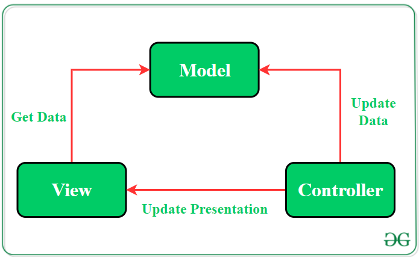

#### Class 2

#### Design your app, MVC, Layout: intro to GUI widget , creating a first Android app Assignment # 1

Creating a new project
Open Android Studio
Choose "Start a new Android Studio project"
Choose an Application name
Leave the company domain as default
Choose a Project Location (make sure you create a folder to contain everything)
Leave everything else default
Press Next
Select the checkbox for "Phone and Tablet", then choose API level 23
Press Next
Choose empty-actvity
Press Next
Leave the Activity Name and Layout Name as defaults
Press Finish
Observe Android Studio and Gradle generating an Android project for you. Notice that it built a directory structure like app > java > com.example.username.application > MainActivity. MainActivity defines the first thing that will run when someone starts your app, like a Main method in a traditional Java program.

Look at the directory structure outside of app > java and observe what's put under app > res > layout. This is where the templates for Android applications exist. Notice the file activity_main.xml defines what's shown on the screen when your app is run.

Android Studio Layout
You should be familiar with the Android Studio layout as it is very similar to IntelliJ IDEA.

Now we will go over a quick breakdown of each Tool Window

Lefthand side - Project Tool Window
Main View - Editor
Event Listeners
Add a button that can update the text of a text view on the page.

Android Emulators
Begin the process of running the application. Note that you have the ability to run on multiple phone types in the emulator, and you should definitely do this: your app needs to work on a variety of device types and sizes.

Activity Lifecycle
Create a new Activity subclass called LifeCycleActivity and implement the following code:

private static final String TAG = "LifecycleActivity";

@Override
protected void onCreate(@Nullable Bundle savedInstanceState) {
    super.onCreate(savedInstanceState);

    Log.d(TAG, "onCreate Called");
}

@Override
protected void onStart() {
    super.onStart();

    Log.d(TAG, "onStart Called");
}

@Override
protected void onResume() {
    super.onResume();

    Log.d(TAG, "onResume Called");
}

@Override
protected void onPause() {
    super.onPause();

    Log.d(TAG, "onPause Called");
}

@Override
protected void onStop() {
    super.onStop();

    Log.d(TAG, "onStop called");
}

@Override
protected void onRestart() {
    super.onRestart();

    Log.d(TAG, "onRestart: called");
}

@Override
protected void onDestroy() {
    super.onDestroy();

    Log.d(TAG, "onDestroy: called");
}
Then, navigate to the HomeActivity and change it to extend LifeCycleActivity.

Run the application to and show accessing LogCat and the lifecycle methods being called.

Android Studio
Get students familiar with the Android Studio Ecosystem.
Installing Toolchains
Compiling your first program
Familiar with Dev environment

MVC (Model View Controller) Architecture Pattern in Android with Example
Last Updated: 27-10-2020
Developing an android application by applying a software architecture pattern is always preferred by the developers. An architecture pattern gives modularity to the project files and assures that all the codes get covered in Unit testing. It makes the task easy for developers to maintain the software and to expand the features of the application in the future. There are some architectures that are very popular among developers and one of them is the Model—View—Controller(MVC) Pattern. The MVC pattern suggests splitting the code into 3 components. While creating the class/file of the application, the developer must categorize it into one of the following three layers:

Model: This component stores the application data. It has no knowledge about the interface. The model is responsible for handling the domain logic(real-world business rules) and communication with the database and network layers.
View: It is the UI(User Interface) layer that holds components that are visible on the screen. Moreover, it provides the visualization of the data stored in the Model and offers interaction to the user.
Controller: This component establishes the relationship between the View and the Model. It contains the core application logic and gets informed of the user’s behavior and updates the Model as per the need.
MVC (Model—View—Controller) Architecture Pattern in Android

In spite of applying MVC schema to give a modular design to the application, code layers do depend on each other. In this pattern, View and Controller both depend upon the Model. Multiple approaches are possible to apply the MVC pattern in the project:

Approach 1: Activities and fragments can perform the role of Controller and are responsible for updating the View.
Approach 2: Use activity or fragments as views and controller while Model will be a separate class that does not extend any Android class.
In MVC architecture, application data is updated by the controller and View gets the data. Since the Model component is separated, it could be tested independently of the UI. Further, if the View layer respects the single responsibility principle then their role is just to update the Controller for every user event and just display data from the Model, without implementing any business logic. In this case, UI tests should be enough to cover the functionalities of the View.

Example of MVC Architecture
To understand the implementation of the MVC architecture pattern more clearly, here is a simple example of an android application. This application will have 3 buttons and each one of them displays the count that how many times the user has clicked that particular button. To develop this application the code has been separated in the following manner:

Controller and View will be handled by the Activity. Whenever the user clicks the buttons, activity directs the Model to handle the further operations. The activity will act as an observer.
The Model will be a separate class that contains the data to be displayed. The operations on the data will be performed by functions of this class and after updating the values of the data this Observable class notifies the Observer(Activity) about the change.
Below is the complete step-by-step implementation of this android application using the MVC architecture pattern:

Note: Following steps are performed on Android Studio version 4.0

Step 1: Create a new project

Click on File, then New => New Project.
Choose Empty activity
Select language as Java/Kotlin
Select the minimum SDK as per your need.
Step 2: Modify String.xml file

All the strings which are used in the activity are listed in this file.

Buttons
A button consists of text or an icon (or both text and an icon) that communicates what action occurs when the user touches it.

Depending on whether you want a button with text, an icon, or both, you can create the button in your layout in three ways:

With text, using the Button class:

<Button
    android:layout_width="wrap_content"
    android:layout_height="wrap_content"
    android:text="@string/button_text"
    ... />
With an icon, using the ImageButton class:

<ImageButton
    android:layout_width="wrap_content"
    android:layout_height="wrap_content"
    android:src="@drawable/button_icon"
    android:contentDescription="@string/button_icon_desc"
    ... />
With text and an icon, using the Button class with the android:drawableLeft attribute:

<Button
    android:layout_width="wrap_content"
    android:layout_height="wrap_content"
    android:text="@string/button_text"
    android:drawableLeft="@drawable/button_icon"
    ... />
Key classes are the following:

Button
ImageButton
Responding to Click Events
When the user clicks a button, the Button object receives an on-click event.

To define the click event handler for a button, add the android:onClick attribute to the <Button> element in your XML layout. The value for this attribute must be the name of the method you want to call in response to a click event. The Activity hosting the layout must then implement the corresponding method.

For example, here's a layout with a button using android:onClick:

<?xml version="1.0" encoding="utf-8"?>
<Button xmlns:android="http://schemas.android.com/apk/res/android"
    android:id="@+id/button_send"
    android:layout_width="wrap_content"
    android:layout_height="wrap_content"
    android:text="@string/button_send"
    android:onClick="sendMessage" />
Within the Activity that hosts this layout, the following method handles the click event:

KOTLIN
JAVA

/** Called when the user touches the button */
public void sendMessage(View view) {
    // Do something in response to button click
}
The method you declare in the android:onClick attribute must have a signature exactly as shown above. Specifically, the method must:

Be public
Return void
Define a View as its only parameter (this will be the View that was clicked)
Using an OnClickListener
You can also declare the click event handler programmatically rather than in an XML layout. This might be necessary if you instantiate the Button at runtime or you need to declare the click behavior in a Fragment subclass.

To declare the event handler programmatically, create an View.OnClickListener object and assign it to the button by calling setOnClickListener(View.OnClickListener). For example:

KOTLIN
JAVA

Button button = (Button) findViewById(R.id.button_send);
button.setOnClickListener(new View.OnClickListener() {
    public void onClick(View v) {
        // Do something in response to button click
    }
});
Styling Your Button
The appearance of your button (background image and font) may vary from one device to another, because devices by different manufacturers often have different default styles for input controls.

You can control exactly how your controls are styled using a theme that you apply to your entire application. For instance, to ensure that all devices running Android 4.0 and higher use the Holo theme in your app, declare android:theme="@android:style/Theme.Holo" in your manifest's <application> element. Also read the blog post, Holo Everywhere for information about using the Holo theme while supporting older devices.

To customize individual buttons with a different background, specify the android:background attribute with a drawable or color resource. Alternatively, you can apply a style for the button, which works in a manner similar to HTML styles to define multiple style properties such as the background, font, size, and others. For more information about applying styles, see Styles and Themes.

Borderless button
One design that can be useful is a "borderless" button. Borderless buttons resemble basic buttons except that they have no borders or background but still change appearance during different states, such as when clicked.

To create a borderless button, apply the borderlessButtonStyle style to the button. For example:

<Button
    android:id="@+id/button_send"
    android:layout_width="wrap_content"
    android:layout_height="wrap_content"
    android:text="@string/button_send"
    android:onClick="sendMessage"
    style="?android:attr/borderlessButtonStyle" />
Custom background
If you want to truly redefine the appearance of your button, you can specify a custom background. Instead of supplying a simple bitmap or color, however, your background should be a state list resource that changes appearance depending on the button's current state.

You can define the state list in an XML file that defines three different images or colors to use for the different button states.

To create a state list drawable for your button background:

Create three bitmaps for the button background that represent the default, pressed, and focused button states.
To ensure that your images fit buttons of various sizes, create the bitmaps as Nine-patch bitmaps.

Place the bitmaps into the res/drawable/ directory of your project. Be sure each bitmap is named properly to reflect the button state that they each represent, such as button_default.9.png, button_pressed.9.png, and button_focused.9.png.
Create a new XML file in the res/drawable/ directory (name it something like button_custom.xml). Insert the following XML:

<?xml version="1.0" encoding="utf-8"?>
<selector xmlns:android="http://schemas.android.com/apk/res/android">
    <item android:drawable="@drawable/button_pressed"
          android:state_pressed="true" />
    <item android:drawable="@drawable/button_focused"
          android:state_focused="true" />
    <item android:drawable="@drawable/button_default" />
</selector>
This defines a single drawable resource, which will change its image based on the current state of the button.

The first <item> defines the bitmap to use when the button is pressed (activated).
The second <item> defines the bitmap to use when the button is focused (when the button is highlighted using the trackball or directional pad).
The third <item> defines the bitmap to use when the button is in the default state (it's neither pressed nor focused).
Note: The order of the <item> elements is important. When this drawable is referenced, the <item> elements are traversed in-order to determine which one is appropriate for the current button state. Because the default bitmap is last, it is only applied when the conditions android:state_pressed and android:state_focused have both evaluated as false.

This XML file now represents a single drawable resource and when referenced by a Button for its background, the image displayed will change based on these three states.

Then simply apply the drawable XML file as the button background:

<Button
    android:id="@+id/button_send"
    android:layout_width="wrap_content"
    android:layout_height="wrap_content"
    android:text="@string/button_send"
    android:onClick="sendMessage"
    android:background="@drawable/button_custom"  />
For more information about this XML syntax, including how to define a disabled, hovered, or other button states, read about State List Drawable.

Input events overview
On Android, there's more than one way to intercept the events from a user's interaction with your application. When considering events within your user interface, the approach is to capture the events from the specific View object that the user interacts with. The View class provides the means to do so.

Within the various View classes that you'll use to compose your layout, you may notice several public callback methods that look useful for UI events. These methods are called by the Android framework when the respective action occurs on that object. For instance, when a View (such as a Button) is touched, the onTouchEvent() method is called on that object. However, in order to intercept this, you must extend the class and override the method. However, extending every View object in order to handle such an event would not be practical. This is why the View class also contains a collection of nested interfaces with callbacks that you can much more easily define. These interfaces, called event listeners, are your ticket to capturing the user interaction with your UI.

While you will more commonly use the event listeners to listen for user interaction, there may come a time when you do want to extend a View class, in order to build a custom component. Perhaps you want to extend the Button class to make something more fancy. In this case, you'll be able to define the default event behaviors for your class using the class event handlers.

Event listeners
An event listener is an interface in the View class that contains a single callback method. These methods will be called by the Android framework when the View to which the listener has been registered is triggered by user interaction with the item in the UI.

Included in the event listener interfaces are the following callback methods:

onClick()
From View.OnClickListener. This is called when the user either touches the item (when in touch mode), or focuses upon the item with the navigation-keys or trackball and presses the suitable "enter" key or presses down on the trackball.
onLongClick()
From View.OnLongClickListener. This is called when the user either touches and holds the item (when in touch mode), or focuses upon the item with the navigation-keys or trackball and presses and holds the suitable "enter" key or presses and holds down on the trackball (for one second).
onFocusChange()
From View.OnFocusChangeListener. This is called when the user navigates onto or away from the item, using the navigation-keys or trackball.
onKey()
From View.OnKeyListener. This is called when the user is focused on the item and presses or releases a hardware key on the device.
onTouch()
From View.OnTouchListener. This is called when the user performs an action qualified as a touch event, including a press, a release, or any movement gesture on the screen (within the bounds of the item).
onCreateContextMenu()
From View.OnCreateContextMenuListener. This is called when a Context Menu is being built (as the result of a sustained "long click"). See the discussion on context menus in the Menus developer guide.
These methods are the sole inhabitants of their respective interface. To define one of these methods and handle your events, implement the nested interface in your Activity or define it as an anonymous class. Then, pass an instance of your implementation to the respective View.set...Listener() method. (E.g., call setOnClickListener() and pass it your implementation of the OnClickListener.)

The example below shows how to register an on-click listener for a Button.

KOTLIN
JAVA

// Create an anonymous implementation of OnClickListener
private OnClickListener corkyListener = new OnClickListener() {
    public void onClick(View v) {
      // do something when the button is clicked
    }
};

protected void onCreate(Bundle savedValues) {
    ...
    // Capture our button from layout
    Button button = (Button)findViewById(R.id.corky);
    // Register the onClick listener with the implementation above
    button.setOnClickListener(corkyListener);
    ...
}
You may also find it more convenient to implement OnClickListener as a part of your Activity. This will avoid the extra class load and object allocation. For example:

KOTLIN
JAVA

public class ExampleActivity extends Activity implements OnClickListener {
    protected void onCreate(Bundle savedValues) {
        ...
        Button button = (Button)findViewById(R.id.corky);
        button.setOnClickListener(this);
    }

    // Implement the OnClickListener callback
    public void onClick(View v) {
      // do something when the button is clicked
    }
    ...
}
Notice that the onClick() callback in the above example has no return value, but some other event listener methods must return a boolean. The reason depends on the event. For the few that do, here's why:

onLongClick() - This returns a boolean to indicate whether you have consumed the event and it should not be carried further. That is, return true to indicate that you have handled the event and it should stop here; return false if you have not handled it and/or the event should continue to any other on-click listeners.
onKey() - This returns a boolean to indicate whether you have consumed the event and it should not be carried further. That is, return true to indicate that you have handled the event and it should stop here; return false if you have not handled it and/or the event should continue to any other on-key listeners.
onTouch() - This returns a boolean to indicate whether your listener consumes this event. The important thing is that this event can have multiple actions that follow each other. So, if you return false when the down action event is received, you indicate that you have not consumed the event and are also not interested in subsequent actions from this event. Thus, you will not be called for any other actions within the event, such as a finger gesture, or the eventual up action event.
Remember that hardware key events are always delivered to the View currently in focus. They are dispatched starting from the top of the View hierarchy, and then down, until they reach the appropriate destination. If your View (or a child of your View) currently has focus, then you can see the event travel through the dispatchKeyEvent() method. As an alternative to capturing key events through your View, you can also receive all of the events inside your Activity with onKeyDown() and onKeyUp().

Also, when thinking about text input for your application, remember that many devices only have software input methods. Such methods are not required to be key-based; some may use voice input, handwriting, and so on. Even if an input method presents a keyboard-like interface, it will generally not trigger the onKeyDown() family of events. You should never build a UI that requires specific key presses to be controlled unless you want to limit your application to devices with a hardware keyboard. In particular, do not rely on these methods to validate input when the user presses the return key; instead, use actions like IME_ACTION_DONE to signal the input method how your application expects to react, so it may change its UI in a meaningful way. Avoid assumptions about how a software input method should work and just trust it to supply already formatted text to your application.

Note: Android will call event handlers first and then the appropriate default handlers from the class definition second. As such, returning true from these event listeners will stop the propagation of the event to other event listeners and will also block the callback to the default event handler in the View. So be certain that you want to terminate the event when you return true.

Event handlers
If you're building a custom component from View, then you'll be able to define several callback methods used as default event handlers. In the document about Custom View Components, you'll learn some of the common callbacks used for event handling, including:

onKeyDown(int, KeyEvent) - Called when a new key event occurs.
onKeyUp(int, KeyEvent) - Called when a key up event occurs.
onTrackballEvent(MotionEvent) - Called when a trackball motion event occurs.
onTouchEvent(MotionEvent) - Called when a touch screen motion event occurs.
onFocusChanged(boolean, int, Rect) - Called when the view gains or loses focus.
There are some other methods that you should be aware of, which are not part of the View class, but can directly impact the way you're able to handle events. So, when managing more complex events inside a layout, consider these other methods:

Activity.dispatchTouchEvent(MotionEvent) - This allows your Activity to intercept all touch events before they are dispatched to the window.
ViewGroup.onInterceptTouchEvent(MotionEvent) - This allows a ViewGroup to watch events as they are dispatched to child Views.
ViewParent.requestDisallowInterceptTouchEvent(boolean) - Call this upon a parent View to indicate that it should not intercept touch events with onInterceptTouchEvent(MotionEvent).
Touch mode
When a user is navigating a user interface with directional keys or a trackball, it is necessary to give focus to actionable items (like buttons) so the user can see what will accept input. If the device has touch capabilities, however, and the user begins interacting with the interface by touching it, then it is no longer necessary to highlight items, or give focus to a particular View. Thus, there is a mode for interaction named "touch mode."

For a touch-capable device, once the user touches the screen, the device will enter touch mode. From this point onward, only Views for which isFocusableInTouchMode() is true will be focusable, such as text editing widgets. Other Views that are touchable, like buttons, will not take focus when touched; they will simply fire their on-click listeners when pressed.

Any time a user hits a directional key or scrolls with a trackball, the device will exit touch mode, and find a view to take focus. Now, the user may resume interacting with the user interface without touching the screen.

The touch mode state is maintained throughout the entire system (all windows and activities). To query the current state, you can call isInTouchMode() to see whether the device is currently in touch mode.

Handling focus
The framework will handle routine focus movement in response to user input. This includes changing the focus as Views are removed or hidden, or as new Views become available. Views indicate their willingness to take focus through the isFocusable() method. To change whether a View can take focus, call setFocusable(). When in touch mode, you may query whether a View allows focus with isFocusableInTouchMode(). You can change this with setFocusableInTouchMode().

On devices running Android 9 (API level 28) or higher, activities don't assign an initial focus. Instead, you must explicitly request initial focus, if desired.

Focus movement is based on an algorithm which finds the nearest neighbor in a given direction. In rare cases, the default algorithm may not match the intended behavior of the developer. In these situations, you can provide explicit overrides with the following XML attributes in the layout file: nextFocusDown, nextFocusLeft, nextFocusRight, and nextFocusUp. Add one of these attributes to the View from which the focus is leaving. Define the value of the attribute to be the id of the View to which focus should be given. For example:

<LinearLayout
    android:orientation="vertical"
    ... >
  <Button android:id="@+id/top"
          android:nextFocusUp="@+id/bottom"
          ... />
  <Button android:id="@+id/bottom"
          android:nextFocusDown="@+id/top"
          ... />
</LinearLayout>
Ordinarily, in this vertical layout, navigating up from the first Button would not go anywhere, nor would navigating down from the second Button. Now that the top Button has defined the bottom one as the nextFocusUp (and vice versa), the navigation focus will cycle from top-to-bottom and bottom-to-top.

If you'd like to declare a View as focusable in your UI (when it is traditionally not), add the android:focusable XML attribute to the View, in your layout declaration. Set the value true. You can also declare a View as focusable while in Touch Mode with android:focusableInTouchMode.

To request a particular View to take focus, call requestFocus().

To listen for focus events (be notified when a View receives or loses focus), use onFocusChange(), as discussed in the Event listeners section.

#### Assignment 1

Installation Android Studio 
Install Gradle

Build your first Android Studio app
