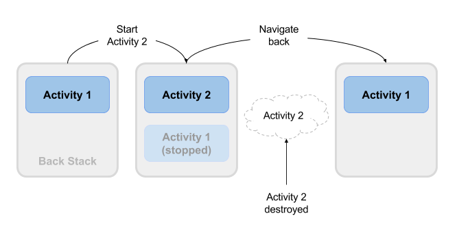

#### Class3

Topic:
Activity and Intent Activity lifecycle: state and preferences

Understanding the Activity Lifecycle
As you have seen, an activity is simply a screen or user interface in an Android application—either a full screen or a floating window that a user interacts with. An Android app is made up of different activities that interact with the user as well as one another. For example, a simple calculator would use one single activity. If you enhanced the calculator app to switch between a simple version and a scientific version, you would then use two activities.

Every Android application runs inside its own process. Processes are started and stopped to run an application and also can be killed to conserve memory and resources. Activities, in turn, are run inside the main UI thread of the application’s process.

Once an activity is launched, it goes through a lifecycle, a term that refers to the steps the activity progresses through as the user (and OS) interacts with it. There are specific method callbacks that let you react to the changes during the activity lifecycle.

The activity lifecyle has four states.

When the activity is on the foreground of the application, it is the running activity. Only one activity can be in the running state at a given time.
If the activity loses focus but remains visible (because a smaller activity appears on top), the activity is paused.
If the activity is completely covered by another running activity, the original activity is stopped. When an activity stops, you will lose any state and will need to re-create the current state of the user interface when the activity is restarted.
While the activity is paused or stopped, the system can kill it if it needs to reclaim memory. The user can restart the activity.
While the application moves through the different states, the android.app.Activity lifecycle methods (or callbacks) get called by the system. These callbacks are as follows.

onCreate(Bundle savedInstanceState)is called when the activity is created for the first time. You should initialize data, create an initial view, or reclaim the activity’s frozen state if previously saved (this is covered later). The onCreate callback is always followed by onStart.
onStart() is called when the activity is becoming visible. This is an ideal place to write code that affects the UI of the application, such as an event that deals with user interaction. This callback is normally followed by onResume but could be followed by onStop if the activity becomes hidden.
onResume() is called when the activity is running in the foreground and the user can interact with it. It is followed by onPause.
onPause() is called when another activity comes to the foreground. The implementation needs to be quick, because the other activity cannot run until this method returns. The onPause callback is followed by onResume if the activity returns to the foreground, or by onStop if the activity becomes invisible.
onStop() is called when the activity is invisible to the user; either a new activity has started, an existing activity has resumed, or this activity is getting destroyed. The onStop callback is followed by onRestart if the activity returns to the foreground.
onRestart() is called when the activity is being restarted, as when the activity is returning to the foreground. It is always followed by onStart.
onDestroy() is called by the system before the activity is destroyed, either because the activity is finishing or because the system is reclaiming the memory the activity is using.
Figure 4.7 illustrates the various states the activity goes through and the order in which the callback methods get invoked.

Activity lifecycle showing activity states

Exploring the Android Activity Lifecycle
Now let’s look at how the Android activity lifecycle works. In Chapter 3, you overrode the onCreate method. Now you’ll override the remaining lifecycle methods in your TimerActivity class by following these steps.

Open the TimerActivity.java file in the project, and override the existing onStart method, which is called when the activity is first viewed. Call the onStart method of the parent class, and log a debug message:

@Override
public void onStart(){
    super.onStart();
    Log.d(CLASS_NAME, "onStart");
}
Override the existing onPause method, which is called when another activity is called to the foreground. Call the onPause method of the parent and log a debug message:

@Override
public void onPause(){
    super.onPause();
    Log.d(CLASS_NAME, "onPause");
}
Override the existing onResume method, which is called when the activity is running in the foreground and the user can interact with it. Call the onResume method of the parent class, and log a debug message:

@Override
public void onResume(){
    super.onResume();
    Log.d(CLASS_NAME, "onResume");
}
Override the existing onStop method, which is called when the activity is invisible to the end user. Call the onStop method of the parent class, and log a debug message:

@Override
public void onStop(){
    super.onStop();
    Log.d(CLASS_NAME, "onStop");
}
Override the existing onDestroy method, which is called when the activity is removed from the system and can no longer be interacted with. Call the onDestroy method of the parent class, and log a debug message:

@Override
public void onDestroy(){
    super.onDestroy();
    Log.d(CLASS_NAME, "onDestroy");
}
Override the existing onRestart method, which is called when the activity is started again and returns to the foreground. Call the onRestart method of the parent class and log a debug message:

The Activity Lifecycle and Managing State
Contents:

Introduction
About the activity lifecycle
Activity states and lifecycle callback methods
Configuration changes and activity state
Related Practical
Learn More

In this chapter you'll learn about the activity lifecycle, the callback events you can implement to perform tasks in each stage of the lifecycle, and how to handle activity instance states throughout the activity lifecycle.

About the activity lifecycle
The activity lifecycle is the set of states an activity can be in during its entire lifetime, from the time it is initially created to when it is destroyed and the system reclaims that activity's resources. As the user interacts with your app and other apps on the device, the different activities move into different states.

For example, when you start an app, the app's main activity (Activity 1) is started, comes to the foreground, and receives the user focus. When you start a second activity (Activity 2), that new activity is also created and started, and the main activity is stopped. When you're done with the second activity and navigate back, the first activity resumes. The second activity stops and is no longer needed; if the user does not resume the second activity, it is eventually destroyed by the system.Activity Lifecycle

Activity states and lifecycle callback methods
When an activity transitions into and out of the different lifecycle states as it runs, the Android system calls several lifecycle callback methods at each stage. All of the callback methods are hooks that you can override in each of your Activity classes to define how that activity behaves when the user leaves and re-enters the activity. Keep in mind that the lifecycle states (and callbacks) are per activity, not per app, and you may implement different behavior at different points in the lifecycle for different activities in your app.

This figure shows each of the activity states and the callback methods that occur as the activity transitions between different states:Diagram of the App Lifecycle

Depending on the complexity of your activity, you probably don't need to implement all the lifecycle callback methods in your activities. However, it's important that you understand each one and implement those that ensure your app behaves the way users expect. Managing the lifecycle of your activities by implementing callback methods is crucial to developing a strong and flexible application.

Activity created (onCreate() method)
@Override
public void onCreate(Bundle savedInstanceState) {
    super.onCreate(savedInstanceState);
    // The activity is being created.
}
Your activity enters into the created state when it is started for the first time. When an activity is first created the system calls the onCreate() method to initialize that activity. For example, when the user taps your app icon from the Home screen to start that app, the system calls the onCreate() method for the activity in your app that you've declared to be the "launcher" or "main" activity. In this case the main activity's onCreate() method is analogous to the main() method in other programs.

Similarly, if your app starts another activity with an intent (either explicit or implicit), the system matches your intent request with an activity and calls onCreate() for that new activity.

The onCreate() method is the only required callback you must implement in your activity class. In your onCreate() method you perform basic application startup logic that should happen only once, such as setting up the user interface, assigning class-scope variables, or setting up background tasks.

Created is a transient state; the activity remains in the created state only as long as it takes to run onCreate(), and then the activity moves to the started state.

Activity started (onStart() method)
@Override
protected void onStart() {
    super.onStart();
    // The activity is about to become visible.
}
After your activity is initialized with onCreate(), the system calls the onStart() method, and the activity is in the started state. The onStart() method is also called if a stopped activity returns to the foreground, such as when the user clicks the back or up buttons to navigate to the previous screen. While onCreate() is called only once when the activity is created, the onStart() method may be called many times during the lifecycle of the activity as the user navigates around your app.

When an activity is in the started state and visible on the screen, the user cannot interact with it until onResume() is called, the activity is running, and the activity is in the foreground.

Typically you implement onStart() in your activity as a counterpart to the onStop() method. For example, if you release hardware resources (such as GPS or sensors) when the activity is stopped, you can re-register those resources in the onStart() method.

Started, like created, is a transient state. After starting the activity moves into the resumed (running) state.

Activity resumed/running (onResume() method)
@Override
protected void onResume() {
    super.onResume();
    // The activity has become visible (it is now "resumed").
}
Your activity is in the resumed state when it is initialized, visible on screen, and ready to use. The resumed state is often called the running state, because it is in this state that the user is actually interacting with your app.

The first time the activity is started the system calls the onResume() method just after onStart(). The onResume() method may also be called multiple times, each time the app comes back from the paused state.

As with the onStart() and onStop() methods, which are implemented in pairs, you typically only implement onResume() as a counterpart to onPause(). For example, if in the onPause() method you halt any onscreen animations, you would start those animations again in onResume().

The activity remains in the resumed state as long as the activity is in the foreground and the user is interacting with it. From the resumed state the activity can move into the paused state.

Activity paused (onPause() method)
@Override
protected void onPause() {
    super.onPause();
    // Another activity is taking focus
    // (this activity is about to be "paused").
}
The paused state can occur in several situations:

The activity is going into the background, but has not yet been fully stopped. This is the first indication that the user is leaving your activity.
The activity is only partially visible on the screen, because a dialog or other transparent activity is overlaid on top of it.
In multi-window or split screen mode (API 24), the activity is displayed on the screen, but some other activity has the user focus.
The system calls the onPause() method when the activity moves into the paused state. Because the onPause() method is the first indication you get that the user may be leaving the activity, you can use onPause() to stop animation or video playback, release any hardware-intensive resources, or commit unsaved activity changes (such as a draft email).

The onPause() method should execute quickly. Don't use onPause() for for CPU-intensive operations such as writing persistent data to a database. The app may still be visible on screen as it passed through the paused state, and any delays in executing onPause() can slow the user's transition to the next activity. Implement any heavy-load operations when the app is in the stopped state instead.

Note that in multi-window mode (API 24), your paused activity may still fully visible on the screen. In this case you do not want to pause animations or video playback as you would for a partially visible activity. You can use the inMultiWindowMode() method in the Activity class to test whether your app is running in multiwindow mode.

Your activity can move from the paused state into the resumed state (if the user returns to the activity) or to the stopped state (if the user leaves the activity altogether).

Activity stopped (onStop() method)
@Override
protected void onStop() {
    super.onStop();
    // The activity is no longer visible (it is now "stopped")
}
An activity is in the stopped state when it is no longer visible on the screen at all. This is usually because the user has started another activity, or returned to the home screen. The system retains the activity instance in the back stack, and if the user returns to that activity it is restarted again. Stopped activities may be killed altogether by the Android system if resources are low.

The system calls the onStop() method when the activity stops. Implement the onStop() method to save any persistent data and release any remaining resources you did not already release in onPause(), including those operations that may have been too heavyweight for onPause().

Activity destroyed (onDestroy() method)
@Override
protected void onDestroy() {
    super.onDestroy();
    // The activity is about to be destroyed.
}
When your activity is destroyed it is shut down completely, and the Activity instance is reclaimed by the system. This can happen in several cases:

You call finish() in your activity to manually shut it down.
The user navigates back to the previous activity.
The device is in a low memory situation where the system reclaims stopped activities to free more resources.
A device configuration change occurs. You'll learn more about configuration changes later in this chapter.
Use onDestroy() to fully clean up after your activity so that no component (such as a thread) is running after the activity is destroyed.

Note that there are situations where the system will simply kill the activity's hosting process without calling this method (or any others), so you should not rely on onDestroy() to save any required data or activity state. Use onPause() or onStop() instead.

Activity restarted (onRestart() method)
@Override
protected void onRestart() {
    super.onRestart();
    // The activity is about to be restarted.
}
The restarted state is a transient state that only occurs if a stopped activity is started again. In this case the onRestart() method is called in between onStop() and onStart(). If you have resources that need to be stopped or started you typically implement that behavior in onStop() or onStart() rather than onRestart().

Configuration changes and activity state
Earlier in the section onDestroy() you learned that your activities may be destroyed when the user navigates back, by you with the finish() method, or by the system when it needs to free resources. The fourth time your activities are destroyed is when the device undergoes a configuration change.

Configuration changes occur on the device, in runtime, and invalidate the current layout or other resources in your activity The most common form of a configuration change is when the device is rotated. When the device rotates from portrait to landscape, or vice versa, the layout for your app also needs to change. The system recreates the activity to help that activity adapt to the new configuration by loading alternative resources (such as a landscape-specific layout).

Other configuration changes can include a change in locale (the user chooses a different system language), or the user enters multi-window mode (Android 7). In multi-window mode, if you have configured your app to be resizeable, Android recreates your activities to use a layout definition for the new, smaller activity size.

When a configuration change occurs Android system shuts down your activity (calling onPause(), onStop(), and onDestroy()), and then starts it over again from the start (calling onCreate(), onStart(), and onResume()).

Activity instance state
When an activity is destroyed and recreated, there are implications for the runtime state of that activity. When an activity is paused or stopped, the state of the activity is retained because that activity is still held in memory. When an activity is recreated, the state of the activity and any user progress in that activity is lost, with these exceptions:

Some activity state information is automatically saved by default. The state of views in your layout with a unique ID (as defined by the android:id attribute in the layout) are saved and restored when an activity is recreated. In this case, the user-entered values in EditText views are usually retained when the activity is recreated.
The intent that was used to start the activity, and the information stored in that intent's data or extras, remains available to that activity when it is recreated.
The activity state is stored as a set of key/value pairs in a Bundle object called the activity instance state. The system saves default state information to instance state bundle just before the activity is stopped, and passes that bundle to the new activity instance to restore.

You can add your own instance data to the instance state bundle by overriding the onSaveInstanceState() callback. The state bundle is passed to the onCreate() method, so you can restore that instance state data when your activity is created. There is also a corresponding onRestoreInstanceState() callback you can use to restore the state data.

Because device rotation is a common use case for you app, make sure you test that your activity behaves correctly in response to this configuration change, and implement instance state if you need to.

Note: The activity instance state is particular to a specific instance of an activity, running in a single task. If the user force-quits the app, reboots the device, or if the Android system shuts down the entire app process to preserve memory, the activity instance state is lost. To keep state changes across app instances and device reboots, you need to write that data to shared preferences. You'll learn more about shared preferences in a later chapter.

Saving activity instance state
To save information to the instance state bundle, use the onSaveInstanceState() callback. This is not a lifecycle callback method, but it is called when the user is leaving your activity (sometime before the onStop() method).

@Override
public void onSaveInstanceState(Bundle savedInstanceState) {
    super.onSaveInstanceState(savedInstanceState);
    // save your state data to the instance state bundle
}
The onSaveInstanceState() method is passed a Bundle object (a collection of key/value pairs) when it is called. This is the instance state bundle to which you will add your own activity state information.

You learned about bundles in a previous chapter when you added keys and values to the intent extras. Add information to the instance state bundle in the same way, with keys you define and the various "put" methods defined in the Bundle class:

@Override
public void onSaveInstanceState(Bundle savedInstanceState) {
    super.onSaveInstanceState(savedInstanceState);

    // Save the user's current game state
    savedInstanceState.putInt("score", mCurrentScore);
    savedInstanceState.putInt("level", mCurrentLevel);
}
Don't forget to call through to the superclass, to make sure the state of the view hierarchy is also saved to the bundle.

Restoring activity instance state
Once you've saved the activity instance state, you also need to restore it when the activity is recreated. You can do this one of two places:

The onCreate() callback method, which is called with the instance state bundle when the activity is created.
The onRestoreInstanceState() callback, which is called after onStart() after the activity is created.
Most of the time the better place to restore the activity state is in onCreate(), to ensure that your user interface including the state is available as soon as possible.

To restore the saved instances state in onCreate(), test for the existence of a state bundle before you try to get data out of it. When your activity is started for the first time there will be no state and the bundle will be null.

@Override
protected void onCreate(Bundle savedInstanceState) {
    super.onCreate(savedInstanceState); // Always call the superclass first

    // Check whether we're recreating a previously destroyed instance
    if (savedInstanceState != null) {
        // Restore value of members from saved state
        mCurrentScore = savedInstanceState.getInt("score");
        mCurrentLevel = savedInstanceState.getInt("level");
    } else {
        // Probably initialize members with default values for a new instance
    }
    ...
}

Preferences
public abstract class Preferences
extends Object

java.lang.Object
   ↳	java.util.prefs.Preferences
Known direct subclasses
AbstractPreferences

A node in a hierarchical collection of preference data. This class allows applications to store and retrieve user and system preference and configuration data. This data is stored persistently in an implementation-dependent backing store. Typical implementations include flat files, OS-specific registries, directory servers and SQL databases. The user of this class needn't be concerned with details of the backing store.

There are two separate trees of preference nodes, one for user preferences and one for system preferences. Each user has a separate user preference tree, and all users in a given system share the same system preference tree. The precise description of "user" and "system" will vary from implementation to implementation. Typical information stored in the user preference tree might include font choice, color choice, or preferred window location and size for a particular application. Typical information stored in the system preference tree might include installation configuration data for an application.

Nodes in a preference tree are named in a similar fashion to directories in a hierarchical file system. Every node in a preference tree has a node name (which is not necessarily unique), a unique absolute path name, and a path name relative to each ancestor including itself.

The root node has a node name of the empty string (""). Every other node has an arbitrary node name, specified at the time it is created. The only restrictions on this name are that it cannot be the empty string, and it cannot contain the slash character ('/').

The root node has an absolute path name of "/". Children of the root node have absolute path names of "/" + <node name>. All other nodes have absolute path names of <parent's absolute path name> + "/" + <node name>. Note that all absolute path names begin with the slash character.

A node n's path name relative to its ancestor a is simply the string that must be appended to a's absolute path name in order to form n's absolute path name, with the initial slash character (if present) removed. Note that:

No relative path names begin with the slash character.
Every node's path name relative to itself is the empty string.
Every node's path name relative to its parent is its node name (except for the root node, which does not have a parent).
Every node's path name relative to the root is its absolute path name with the initial slash character removed.
Note finally that:

No path name contains multiple consecutive slash characters.
No path name with the exception of the root's absolute path name ends in the slash character.
Any string that conforms to these two rules is a valid path name.
All of the methods that modify preferences data are permitted to operate asynchronously; they may return immediately, and changes will eventually propagate to the persistent backing store with an implementation-dependent delay. The flush method may be used to synchronously force updates to the backing store. Normal termination of the Java Virtual Machine will not result in the loss of pending updates -- an explicit flush invocation is not required upon termination to ensure that pending updates are made persistent.

All of the methods that read preferences from a Preferences object require the invoker to provide a default value. The default value is returned if no value has been previously set or if the backing store is unavailable. The intent is to allow applications to operate, albeit with slightly degraded functionality, even if the backing store becomes unavailable. Several methods, like flush, have semantics that prevent them from operating if the backing store is unavailable. Ordinary applications should have no need to invoke any of these methods, which can be identified by the fact that they are declared to throw BackingStoreException.

The methods in this class may be invoked concurrently by multiple threads in a single JVM without the need for external synchronization, and the results will be equivalent to some serial execution. If this class is used concurrently by multiple JVMs that store their preference data in the same backing store, the data store will not be corrupted, but no other guarantees are made concerning the consistency of the preference data.

This class contains an export/import facility, allowing preferences to be "exported" to an XML document, and XML documents representing preferences to be "imported" back into the system. This facility may be used to back up all or part of a preference tree, and subsequently restore from the backup.

The XML document has the following DOCTYPE declaration:

<!DOCTYPE preferences SYSTEM "http://java.sun.com/dtd/preferences.dtd">
 
Note that the system URI (http://java.sun.com/dtd/preferences.dtd) is not accessed when exporting or importing preferences; it merely serves as a string to uniquely identify the DTD, which is:

<?xml version="1.0" encoding="UTF-8"?>

    <!-- DTD for a Preferences tree. -->

    <!-- The preferences element is at the root of an XML document
         representing a Preferences tree. -->
    <!ELEMENT preferences (root)>

    <!-- The preferences element contains an optional version attribute,
          which specifies version of DTD. -->
    <!ATTLIST preferences EXTERNAL_XML_VERSION CDATA "0.0" >

    <!-- The root element has a map representing the root's preferences
         (if any), and one node for each child of the root (if any). -->
    <!ELEMENT root (map, node*) >

    <!-- Additionally, the root contains a type attribute, which
         specifies whether it's the system or user root. -->
    <!ATTLIST root
              type (system|user) #REQUIRED >

    <!-- Each node has a map representing its preferences (if any),
         and one node for each child (if any). -->
    <!ELEMENT node (map, node*) >

    <!-- Additionally, each node has a name attribute -->
    <!ATTLIST node
              name CDATA #REQUIRED >

    <!-- A map represents the preferences stored at a node (if any). -->
    <!ELEMENT map (entry*) >

    <!-- An entry represents a single preference, which is simply
          a key-value pair. -->
    <!ELEMENT entry EMPTY >
    <!ATTLIST entry
              key   CDATA #REQUIRED
              value CDATA #REQUIRED >
 
Every Preferences implementation must have an associated PreferencesFactory implementation. Every Java(TM) SE implementation must provide some means of specifying which PreferencesFactory implementation is used to generate the root preferences nodes. This allows the administrator to replace the default preferences implementation with an alternative implementation.
Implementation note: In Sun's JRE, the PreferencesFactory implementation is located as follows:

If the system property java.util.prefs.PreferencesFactory is defined, then it is taken to be the fully-qualified name of a class implementing the PreferencesFactory interface. The class is loaded and instantiated; if this process fails then an unspecified error is thrown.

If a PreferencesFactory implementation class file has been installed in a jar file that is visible to the system class loader, and that jar file contains a provider-configuration file named java.util.prefs.PreferencesFactory in the resource directory META-INF/services, then the first class name specified in that file is taken. If more than one such jar file is provided, the first one found will be used. The class is loaded and instantiated; if this process fails then an unspecified error is thrown.

Finally, if neither the above-mentioned system property nor an extension jar file is provided, then the system-wide default PreferencesFactory implementation for the underlying platform is loaded and instantiated.

