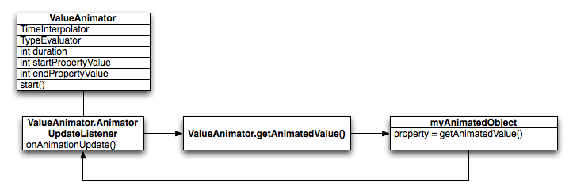

#### Class7
### Topic: Animations and graphics

Introduction to animations
Animations can add visual cues that notify users about what's going on in your app. They are especially useful when the UI changes state, such as when new content loads or new actions become available. Animations also add a polished look to your app, which gives it a higher quality look and feel.

Android includes different animation APIs depending on what type of animation you want, so this page provides an overview of the different ways you can add motion to your UI.

To better understand when you should use animations, also see the material design guide to motion.

Animate bitmaps

Figure 1. An animated drawable

When you want to animate a bitmap graphic such as an icon or illustration, you should use the drawable animation APIs. Usually, these animations are defined statically with a drawable resource, but you can also define the animation behavior at runtime.

For example, animating a play button transforming into a pause button when tapped is a nice way to communicate to the user that the two actions are related, and that pressing one makes the other visible.

For more information, read Animate Drawable Graphics.

Animate UI visibility and motion

Figure 2. A subtle animation when a dialog appears and disappears makes the UI change less jarring

When you need to change the visibility or position of views in your layout, you should include subtle animations to help the user understand how the UI is changing.

To move, reveal, or hide views within the current layout, you can use the property animation system provided by the android.animation package, available in Android 3.0 (API level 11) and higher. These APIs update the properties of your View objects over a period of time, continuously redrawing the view as the properties change. For example, when you change the position properties, the view moves across the screen, or when you change the alpha property, the view fades in or out.

To create these animations with the least amount of effort, you can enable animations on your layout so that when you simply change the visibility of a view, an animation applies automatically. For more information, see Auto Animate Layout Updates.

To learn how to build animations with the property animation system, read the Property Animation Overview. Or see the following pages to create common animations:

Change a view visibility with a crossfade

Change a view visibility with a circular reveal

Swap views with a card flip

Change the view size with a zoom animation

Physics-based motion

Figure 3. Animation built with ObjectAnimator

Figure 4. Animation built with physics-based APIs

Whenever possible, your animations should apply real-world physics so they are natural-looking. For example, they should maintain momentum when their target changes, and make smooth transitions during any changes.

To provide these behaviors, the Android Support library includes physics-based animation APIs that rely on the laws of physics to control how your animations occur.

Two common physics-based animations are the following:

Spring Animation
Fling Animation
Animations not based on physics—such as those built with ObjectAnimator APIs—are fairly static and have a fixed duration. If the target value changes, you need to cancel the animation at the time of target value change, re-configure the animation with a new value as the new start value, and add the new target value. Visually, this process creates an abrupt stop in the animation, and a disjointed movement afterwards, as shown in figure 3.

Whereas, animations built by with physics-based animation APIs such as DynamicAnimation are driven by force. The change in the target value results in a change in force. The new force applies on the existing velocity, which makes a continuous transition to the new target. This process results in a more natural-looking animation, as shown in figure 4.

Animate layout changes

Figure 5. An animation to show more details can be achieved by either changing the layout or starting a new activity

On Android 4.4 (API level 19) and higher, you can use the transition framework to create animations when you swap the layout within the current activity or fragment. All you need to do is specify the starting and ending layout, and what type of animation you want to use. Then the system figures out and executes an animation between the two layouts. You can use this to swap out the entire UI or to move/replace just some views.

For example, when the user taps an item to see more information, you can replace the layout with the item details, applying a transition like the one shown in figure 5.

The starting and ending layout are each stored in a Scene, though the starting scene is usually determined automatically from the current layout. You then create a Transition to tell the system what type of animation you want, and then call TransitionManager.go() and the system runs the animation to swap the layouts.

For more information, read Animate Between Layouts Using a Transition. And for sample code, check out BasicTransition.

Animate between activities
On Android 5.0 (API level 21) and higher, you can also create animations that transition between your activities. This is based on the same transition framework described above to animate layout changes, but it allows you to create animations between layouts in separate activities.

You can apply simple animations such as sliding the new activity in from the side or fading it in, but you can also create animations that transition between shared views in each activity. For example, when the user taps an item to see more information, you can transition into a new activity with an animation that seamlessly grows that item to fill the screen, like the animation shown in figure 5.

As usual, you call startActivity(), but pass it a bundle of options provided by ActivityOptions.makeSceneTransitionAnimation(). This bundle of options may include which views are shared between the activities so the transition framework can connect them during the animation.

For all the details, see Start an Activity with an Animation. And for sample code, check out ActivitySceneTransitionBasic

Property Animation Overview
The property animation system is a robust framework that allows you to animate almost anything. You can define an animation to change any object property over time, regardless of whether it draws to the screen or not. A property animation changes a property's (a field in an object) value over a specified length of time. To animate something, you specify the object property that you want to animate, such as an object's position on the screen, how long you want to animate it for, and what values you want to animate between.

The property animation system lets you define the following characteristics of an animation:

Duration: You can specify the duration of an animation. The default length is 300 ms.
Time interpolation: You can specify how the values for the property are calculated as a function of the animation's current elapsed time.
Repeat count and behavior: You can specify whether or not to have an animation repeat when it reaches the end of a duration and how many times to repeat the animation. You can also specify whether you want the animation to play back in reverse. Setting it to reverse plays the animation forwards then backwards repeatedly, until the number of repeats is reached.
Animator sets: You can group animations into logical sets that play together or sequentially or after specified delays.
Frame refresh delay: You can specify how often to refresh frames of your animation. The default is set to refresh every 10 ms, but the speed in which your application can refresh frames is ultimately dependent on how busy the system is overall and how fast the system can service the underlying timer.
To see a full example of property animation, see the ChangeColor class in the CustomTransition sample on GitHub.

How property animation works
First, let's go over how an animation works with a simple example. Figure 1 depicts a hypothetical object that is animated with its x property, which represents its horizontal location on a screen. The duration of the animation is set to 40 ms and the distance to travel is 40 pixels. Every 10 ms, which is the default frame refresh rate, the object moves horizontally by 10 pixels. At the end of 40ms, the animation stops, and the object ends at horizontal position 40. This is an example of an animation with linear interpolation, meaning the object moves at a constant speed.

Figure 1. Example of a linear animation

You can also specify animations to have a non-linear interpolation. Figure 2 illustrates a hypothetical object that accelerates at the beginning of the animation, and decelerates at the end of the animation. The object still moves 40 pixels in 40 ms, but non-linearly. In the beginning, this animation accelerates up to the halfway point then decelerates from the halfway point until the end of the animation. As Figure 2 shows, the distance traveled at the beginning and end of the animation is less than in the middle.

Figure 2. Example of a non-linear animation

Let's take a detailed look at how the important components of the property animation system would calculate animations like the ones illustrated above. Figure 3 depicts how the main classes work with one another.

Figure 3. How animations are calculated

The ValueAnimator object keeps track of your animation's timing, such as how long the animation has been running, and the current value of the property that it is animating.

The ValueAnimator encapsulates a TimeInterpolator, which defines animation interpolation, and a TypeEvaluator, which defines how to calculate values for the property being animated. For example, in Figure 2, the TimeInterpolator used would be AccelerateDecelerateInterpolator and the TypeEvaluator would be IntEvaluator.

To start an animation, create a ValueAnimator and give it the starting and ending values for the property that you want to animate, along with the duration of the animation. When you call start() the animation begins. During the whole animation, the ValueAnimator calculates an elapsed fraction between 0 and 1, based on the duration of the animation and how much time has elapsed. The elapsed fraction represents the percentage of time that the animation has completed, 0 meaning 0% and 1 meaning 100%. For example, in Figure 1, the elapsed fraction at t = 10 ms would be .25 because the total duration is t = 40 ms.

When the ValueAnimator is done calculating an elapsed fraction, it calls the TimeInterpolator that is currently set, to calculate an interpolated fraction. An interpolated fraction maps the elapsed fraction to a new fraction that takes into account the time interpolation that is set. For example, in Figure 2, because the animation slowly accelerates, the interpolated fraction, about .15, is less than the elapsed fraction, .25, at t = 10 ms. In Figure 1, the interpolated fraction is always the same as the elapsed fraction.

When the interpolated fraction is calculated, ValueAnimator calls the appropriate TypeEvaluator, to calculate the value of the property that you are animating, based on the interpolated fraction, the starting value, and the ending value of the animation. For example, in Figure 2, the interpolated fraction was .15 at t = 10 ms, so the value for the property at that time would be .15 × (40 - 0), or 6.

How property animation differs from view animation
The view animation system provides the capability to only animate View objects, so if you wanted to animate non-View objects, you have to implement your own code to do so. The view animation system is also constrained in the fact that it only exposes a few aspects of a View object to animate, such as the scaling and rotation of a View but not the background color, for instance.

Another disadvantage of the view animation system is that it only modified where the View was drawn, and not the actual View itself. For instance, if you animated a button to move across the screen, the button draws correctly, but the actual location where you can click the button does not change, so you have to implement your own logic to handle this.

With the property animation system, these constraints are completely removed, and you can animate any property of any object (Views and non-Views) and the object itself is actually modified. The property animation system is also more robust in the way it carries out animation. At a high level, you assign animators to the properties that you want to animate, such as color, position, or size and can define aspects of the animation such as interpolation and synchronization of multiple animators.

The view animation system, however, takes less time to setup and requires less code to write. If view animation accomplishes everything that you need to do, or if your existing code already works the way you want, there is no need to use the property animation system. It also might make sense to use both animation systems for different situations if the use case arises.

API overview
You can find most of the property animation system's APIs in android.animation. Because the view animation system already defines many interpolators in android.view.animation, you can use those interpolators in the property animation system as well. The following tables describe the main components of the property animation system.

The Animator class provides the basic structure for creating animations. You normally do not use this class directly as it only provides minimal functionality that must be extended to fully support animating values. The following subclasses extend Animator

Animate drawable graphics

In some situations, images need to be animated on screen. This is useful if you want to display a custom loading animation comprised of several images, or if you want one icon to morph into another after a user's action. Android provides a couple options for animating drawables.

The first option is to use an Animation Drawable. This allows you to specify several static drawable files that will be displayed one at a time to create an animation. The second option is to use an Animated Vector Drawable, which lets you animate the properties of a vector drawable.

Use AnimationDrawable
One way to animate Drawables is to load a series of Drawable resources one after another to create an animation. This is a traditional animation in the sense that it is created with a sequence of different images, played in order, like a roll of film. The AnimationDrawable class is the basis for Drawable animations.

While you can define the frames of an animation in your code, using the AnimationDrawable class API, it's more simply accomplished with a single XML file that lists the frames that compose the animation. The XML file for this kind of animation belongs in the res/drawable/ directory of your Android project. In this case, the instructions are the order and duration for each frame of the animation.

The XML file consists of an <animation-list> element as the root node and a series of child <item> nodes that each define a frame: a drawable resource for the frame and the frame duration. Here's an example XML file for a Drawable animation:

<animation-list xmlns:android="http://schemas.android.com/apk/res/android"
    android:oneshot="true">
    <item android:drawable="@drawable/rocket_thrust1" android:duration="200" />
    <item android:drawable="@drawable/rocket_thrust2" android:duration="200" />
    <item android:drawable="@drawable/rocket_thrust3" android:duration="200" />
</animation-list>
This animation runs for just three frames. By setting the android:oneshot attribute of the list to true, it will cycle just once then stop and hold on the last frame. If it is set false then the animation will loop. With this XML saved as rocket_thrust.xml in the res/drawable/ directory of the project, it can be added as the background image to a View and then called to play. Here's an example Activity, in which the animation is added to an ImageView and then animated when the screen is touched:

KOTLIN
JAVA

AnimationDrawable rocketAnimation;

public void onCreate(Bundle savedInstanceState) {
  super.onCreate(savedInstanceState);
  setContentView(R.layout.main);

  ImageView rocketImage = (ImageView) findViewById(R.id.rocket_image);
  rocketImage.setBackgroundResource(R.drawable.rocket_thrust);
  rocketAnimation = (AnimationDrawable) rocketImage.getBackground();

  rocketImage.setOnClickListener(new View.OnClickListener() {
      @Override
      public void onClick(View view) {
        rocketAnimation.start();
      }
  });
}
It's important to note that the start() method called on the AnimationDrawable cannot be called during the onCreate() method of your Activity, because the AnimationDrawable is not yet fully attached to the window. If you want to play the animation immediately, without requiring interaction, then you might want to call it from the onStart() method in your Activity, which will get called when Android makes the view visible on screen.

For more information on the XML syntax, available tags and attributes, see Animation Resources.

Use AnimatedVectorDrawable
A vector drawable is a type of drawable that is scalable without getting pixelated or blurry. The AnimatedVectorDrawable class (and AnimatedVectorDrawableCompat for backward-compatibility) lets you animate the properties of a vector drawable, such as rotating it or changing the path data to morph it into a different image.

You normally define animated vector drawables in three XML files:

A vector drawable with the <vector> element in res/drawable/
An animated vector drawable with the <animated-vector> element in res/drawable/
One or more object animators with the <objectAnimator> element in res/animator/
Animated vector drawables can animate the attributes of the <group> and <path> elements. The <group> elements defines a set of paths or subgroups, and the <path> element defines paths to be drawn.

When you define a vector drawable that you want to animate, use the android:name attribute to assign a unique name to groups and paths, so you can refer to them from your animator definitions. For example:

res/drawable/vectordrawable.xml

<vector xmlns:android="http://schemas.android.com/apk/res/android"
    android:height="64dp"
    android:width="64dp"
    android:viewportHeight="600"
    android:viewportWidth="600">
    <group
        android:name="rotationGroup"
        android:pivotX="300.0"
        android:pivotY="300.0"
        android:rotation="45.0" >
        <path
            android:name="v"
            android:fillColor="#000000"
            android:pathData="M300,70 l 0,-70 70,70 0,0 -70,70z" />
    </group>
</vector>
The animated vector drawable definition refers to the groups and paths in the vector drawable by their names:

res/drawable/animatorvectordrawable.xml

<animated-vector xmlns:android="http://schemas.android.com/apk/res/android"
  android:drawable="@drawable/vectordrawable" >
    <target
        android:name="rotationGroup"
        android:animation="@animator/rotation" />
    <target
        android:name="v"
        android:animation="@animator/path_morph" />
</animated-vector>
The animation definitions represent ObjectAnimator or AnimatorSet objects. The first animator in this example rotates the target group 360 degrees:

res/animator/rotation.xml

<objectAnimator
    android:duration="6000"
    android:propertyName="rotation"
    android:valueFrom="0"
    android:valueTo="360" />
The second animator in this example morphs the vector drawable's path from one shape to another. Both paths must be compatible for morphing: they must have the same number of commands and the same number of parameters for each command.

res/animator/path_morph.xml

<set xmlns:android="http://schemas.android.com/apk/res/android">
    <objectAnimator
        android:duration="3000"
        android:propertyName="pathData"
        android:valueFrom="M300,70 l 0,-70 70,70 0,0   -70,70z"
        android:valueTo="M300,70 l 0,-70 70,0  0,140 -70,0 z"
        android:valueType="pathType" />
</set>
Here is the resulting AnimatedVectorDrawable:

