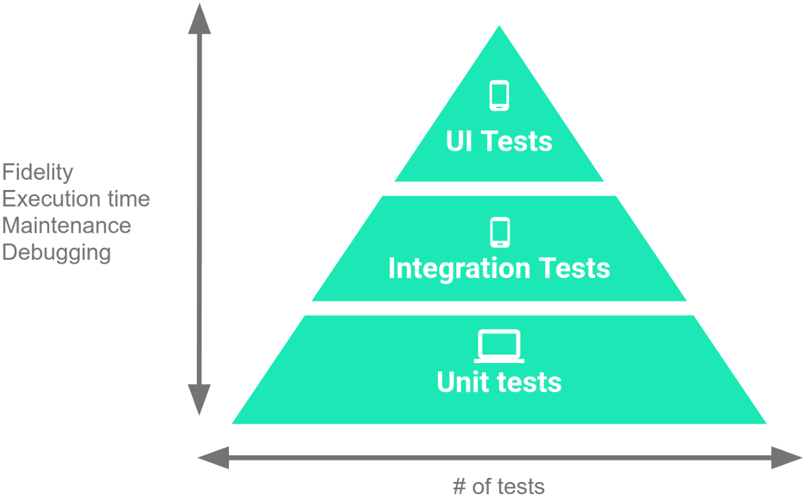

#### Class8
### Topic: Debugging and testing techniques (unit testing and UI testing) Assignment #3

Fundamentals of Testing
Users interact with your app on a variety of levels, from pressing a button to downloading information onto their device. Accordingly, you should test a variety of use cases and interactions as you iteratively develop your app.

Organize your code for testing
As your app expands, you might find it necessary to fetch data from a server, interact with the device's sensors, access local storage, or render complex user interfaces. The versatility of your app demands a comprehensive testing strategy.

Create and test code iteratively
When developing a feature iteratively, you start by either writing a new test or by adding cases and assertions to an existing unit test. The test fails at first because the feature isn't implemented yet.

It's important to consider the units of responsibility that emerge as you design the new feature. For each unit, you write a corresponding unit test. Your unit tests should nearly exhaust all possible interactions with the unit, including standard interactions, invalid inputs, and cases where resources aren't available. Take advantage of Jetpack libraries whenever possible; when you use these well-tested libraries, you can focus on validating behavior that's specific to your app.

The testing development cycle consists of writing a failing unit
           test, writing code to make it pass, and then refactoring. The entire
           feature development cycle exists inside one step of a larger,
           UI-based cycle.
Figure 1. The two cycles associated with iterative, test-driven development
The full workflow, as shown in Figure 1, contains a series of nested, iterative cycles where a long, slow, UI-driven cycle tests the integration of code units. You test the units themselves using shorter, faster development cycles. This set of cycles continues until your app satisfies every use case.

View your app as a series of modules
To make your code easier to test, develop your code in terms of modules, where each module represents a specific task that users complete within your app. This perspective contrasts the stack-based view of an app that typically contains layers representing the UI, business logic, and data.

For example, a "task list" app might have modules for creating tasks, viewing statistics about completed tasks, and taking photographs to associate with a particular task. Such a modular architecture also helps you keep unrelated classes decoupled and provides a natural structure for assigning ownership within your development team.

It's important to set well-defined boundaries around each module, and to create new modules as your app grows in scale and complexity. Each module should have only one area of focus, and the APIs that allow for inter-module communication should be consistent. To make it easier and quicker to test these inter-module interactions, consider creating fake implementations of your modules. In your tests, the real implementation of one module can call the fake implementation of the other module.

As you create a new module, however, don't be too dogmatic about making it full-featured right away. It's OK for a particular module to not have one or more layers of the app's stack.

To learn more about how to define modules in your app, as well as platform support for creating and publishing modules, see Android App Bundles.

Configure your test environment
When setting up your environment and dependencies for creating tests in your app, follow the best practices described in this section.

Organize test directories based on execution environment
A typical project in Android Studio contains two directories in which you place tests. Organize your tests as follows:

The androidTest directory should contain the tests that run on real or virtual devices. Such tests include integration tests, end-to-end tests, and other tests where the JVM alone cannot validate your app's functionality.
The test directory should contain the tests that run on your local machine, such as unit tests.
Consider tradeoffs of running tests on different types of devices
When running your tests on a device, you can choose among the following types:

Real device
Virtual device (such as the emulator in Android Studio)
Simulated device (such as Robolectric)
Real devices offer the highest fidelity but also take the most time to run your tests. Simulated devices, on the other hand, provide improved test speed at the cost of lower fidelity. The platform's improvements in binary resources and realistic loopers, however, allow simulated devices to produce more realistic results.

Virtual devices offer a balance of fidelity and speed. When you use virtual devices to test, use snapshots to minimize setup time in between tests.

Consider whether to use test doubles
When creating tests, you have the option of creating real objects or test doubles, such as fake objects or mock objects. Generally, using real objects in your tests is better than using test doubles, especially when the object under test satisfies one of the following conditions:

The object is a data object.
The object cannot function unless it communicates with the real object version of a dependency. A good example is an event callback handler.
It's hard to replicate the object's communication with a dependency. A good example is a SQL database handler, where an in-memory database provides more robust tests than fakes of database results.
In particular, mocking instances of types that you don't own usually leads to brittle tests that work only when you've understood the complexities of someone else's implementation of that type. Use such mocks only as a last resort. It's OK to mock your own objects, but keep in mind that mocks annotated using @Spy provide more fidelity than mocks that stub out all functionality within a class.

However, it's better to create fake or even mock objects if your tests try to perform the following types of operations on a real object:

Long operations, such as processing a large file.
Non-hermetic actions, such as connecting to an arbitrary open port.
Hard-to-create configurations.
Tip: Check with the library authors to see if they provide any officially-supported testing infrastructures, such as fakes, that you can reliably depend on.

Write your tests
After you've configured your testing environment, it's time to write tests that evaluate your app's functionality. This section describes how to write small, medium, and large tests.

Levels of the Testing Pyramid
A pyramid containing three layers
Figure 2. The Testing Pyramid, showing the three categories of tests that you should include in your app's test suite
The Testing Pyramid, shown in Figure 2, illustrates how your app should include the three categories of tests: small, medium, and large:

Small tests are unit tests that validate your app's behavior one class at a time.
Medium tests are integration tests that validate either interactions between levels of the stack within a module, or interactions between related modules.
Large tests are end-to-end tests that validate user journeys spanning multiple modules of your app.
As you work up the pyramid, from small tests to large tests, each test increases in fidelity but also increases in execution time and effort to maintain and debug. Therefore, you should write more unit tests than integration tests, and more integration tests than end-to-end tests. Although the proportion of tests for each category can vary based on your app's use cases, we generally recommend the following split among the categories: 70 percent small, 20 percent medium, and 10 percent large.

To learn more about the Android Testing Pyramid, see the Test-Driven Development on Android session video from Google I/O 2017, starting at 1:51.

Write small tests
The small tests that you write should be highly-focused unit tests that exhaustively validate the functionality and contracts of each class within your app.

As you add and change methods within a particular class, create and run unit tests against them. If these tests depend on the Android framework, use a unified, device-agnostic API, such as the androidx.test APIs. This consistency allows you to run your test locally without a physical device or emulator.

If your tests rely on resources, enable the includeAndroidResources option in your app's build.gradle file. Your unit tests can then access compiled versions of your resources, allowing the tests to run more quickly and accurately.

app/build.gradle

android {
    // ...

    testOptions {
        unitTests {
            includeAndroidResources = true
        }
    }
}
Note: Android Studio 3.4 and higher provide compiled versions of your resources by default.
Local unit tests
Use the AndroidX Test APIs whenever possible so that your unit tests can run on a device or emulator. For tests that always run on a JVM-powered development machine, you can use Robolectric.

Robolectric simulates the runtime for Android 4.1 (API level 16) or higher and provides community-maintained fakes called shadows. This functionality allows you to test code that depends on the framework without needing to use an emulator or mock objects. Robolectric supports the following aspects of the Android platform:

Component lifecycles
Event loops
All resources

Instrumented unit tests
You can run instrumented unit tests on a physical device or emulator. This form of testing involves significantly slower execution times than local unit tests, however, so it's best to rely on this method only when it's essential to evaluate your app's behavior against actual device hardware.

When running instrumented tests, AndroidX Test makes use of the following threads:

The main thread, also known as the "UI thread" or the "activity thread", where UI interactions and activity lifecycle events occur.
The instrumentation thread, where most of your tests run. When your test suite begins, the AndroidJUnitTest class starts this thread.
If you need a test to execute on the main thread, annotate it using @UiThreadTest.

Write medium tests
In addition to testing each unit of your app by running small tests, you should validate your app's behavior from the module level. To do so, write medium tests, which are integration tests that validate the collaboration and interaction of a group of units.

Use your app's structure and the following examples of medium tests (in order of increasing scope) to define the best way to represent groups of units in your app:

Interactions between a view and view model, such as testing a Fragment object, validating layout XML, or evaluating the data-binding logic of a ViewModel object.
Tests in your app's repository layer, which verify that your different data sources and data access objects (DAOs) interact as expected.
Vertical slices of your app, testing interactions on a particular screen. Such a test verifies the interactions throughout the layers of your app's stack.
Multi-fragment tests that evaluate a specific area of your app. Unlike the other types of medium tests mentioned in this list, this type of test usually requires a real device because the interaction under test involves multiple UI elements.
To carry out these tests, do the following:

Use methods from the Espresso Intents library. To simplify the information that you're passing into these tests, use fakes and stubbing.
Combine your use of IntentSubject and Truth-based assertions to verify the captured intents.
Use Espresso when running instrumented medium tests
Espresso helps keep tasks synchronized as you perform UI interactions similar to the following on a device or on Robolectric:

Performing actions on View objects.
Assessing how users with accessibility needs can use your app.
Locating and activating items within RecyclerView and AdapterView objects.
Validating the state of outgoing intents.
Verifying the structure of a DOM within WebView objects.
To learn more about these interactions and how to use them in your app's tests, see the Espresso guide.

Write large tests
Although it's important to test each class and module within your app in isolation, it's just as important to validate end-to-end workflows that guide users through multiple modules and features. These types of tests form unavoidable bottlenecks in your code, but you can minimize this effect by validating an app that's as close to the actual, finished product as possible.

Note: For each large, workflow-based test that you write, you should also write medium tests that check the functionality of each module included in the workflow. This testing structure makes it easier to determine which step of a critical user journey exhibits unexpected behavior.
If your app is small enough, you might need only one suite of large tests to evaluate your app's functionality as a whole. Otherwise, you should divide your large test suites by team ownership, functional verticals, or user goals.

Typically, it's better to test your app on an emulated device or a cloud-based service like Firebase Test Lab, rather than on a physical device, as you can test multiple combinations of screen sizes and hardware configurations more easily and quickly.

Synchronization support in Espresso
In addition to supporting medium-sized instrumentation tests, Espresso provides support for synchronization when completing the following tasks in large tests:

Completing workflows that cross your app's process boundaries. Available only on Android 8.0 (API level 26) and higher.
Tracking long-running background operations within your app.
Performing off-device tests.
To learn more about these interactions and how to use them in your app's tests, see the Espresso guide.

Complete other testing tasks using AndroidX Test
This section describes how to use elements of AndroidX Test to further refine your app's tests.

Create more readable assertions using Truth
The Guava team provides a fluent assertions library called Truth. You can use this library as an alternative to JUnit- or Hamcrest-based assertions when constructing the validation step—or then step—of your tests.

Usually, you use Truth to express that a particular object has a specific property using phrases that contain the conditions you're testing, such as the following:

assertThat(object).hasFlags(FLAGS)
assertThat(object).doesNotHaveFlags(FLAGS)
assertThat(intent).hasData(URI)
assertThat(extras).string(string_key).equals(EXPECTED)
AndroidX Test supports several additional subjects for Android to make Truth-based assertions even easier to construct:

BundleSubject
IntentSubject
MotionEventSubject
NotificationActionSubject
NotificationSubject
PendingIntentSubject
PointerCoordsSubject
PointerPropertiesSubject
The AndroidX Test API helps you carry out common tasks related to mobile app testing, which the following sections discuss.

Write UI tests
Espresso allows you to programmatically locate and interact with UI elements in your app in a thread-safe way. To learn more, see the Espresso guide.

Run UI tests
The AndroidJUnitRunner class defines an instrumentation-based JUnit test runner that lets you run JUnit 3- or JUnit 4-style test classes on Android devices. The test runner facilitates loading your test package and the app under test onto a device or emulator, running your tests, and reporting the results.

To further increase these tests' reliability, use Android Test Orchestrator, which runs each UI test in its own Instrumentation sandbox. This architecture reduces shared state between tests and isolates app crashes on a per-test basis. For more information about the benefits that Android Test Orchestrator provides as you test your app, see the Android Test Orchestrator guide.

Interact with visible elements
The UI Automator API lets you interact with visible elements on a device, regardless of the activity or fragment that has focus.

Caution: We recommend testing your app using UI Automator only when your app must interact with the system UI or another app to fulfill a critical use case. Because UI Automator interacts with a particular system UI, you must re-run and fix your UI Automator tests after each platform version upgrade and after each new release of Google Play services.

As an alternative to using UI Automator, we recommend adding hermetic tests or separating your large test into a suite of small and medium tests. In particular, focus on testing one piece of inter-app communication at a time, such as sending information to other apps and responding to intent results. The Espresso-Intents tool can help you write these smaller tests.

Add accessibility checks to validate general usability
Your app's interface should allow all users, including those with accessibility needs, to interact with the device and complete tasks more easily in your app.

To help validate your app's accessibility, Android's testing library provides several pieces of built-in functionality, which is discussed in the following sections. To learn more about how to validate your app's usability for different types of users, see the guide on testing your app's accessibility.

Robolectric
Enable accessibility checks by including the @AccessibilityChecks annotation at the beginning of your test suite, as shown in the following code snippet:

KOTLIN
JAVA

import org.robolectric.annotation.AccessibilityChecks;

@AccessibilityChecks
public class MyTestSuite {
    // Your tests here.
}
Espresso
Enable accessibility checks by calling AccessibilityChecks.enable() in your test suite's setUp() method, as shown in the following code snippet.

For more information on how to interpret the results of these accessibility checks, see the Espresso accessibility checking guide.

KOTLIN
JAVA

import androidx.test.espresso.accessibility.AccessibilityChecks;

@Before
public void setUp() {
    AccessibilityChecks.enable();
}
Drive activity and fragment lifecycles
Use the ActivityScenario and FragmentScenario classes to test how your app's activities and fragments respond to system-level interruptions and configuration changes. To learn more, see the guides on how to test activities and test fragments.

Note: Given the device-specific conditions under which fragments behave, it's best to work with FragmentScenario as part of your instrumented tests.
Manage service lifecycles
AndroidX Test includes code for managing the lifecycles of key services. To learn how to define these rules, see the JUnit4 Rules guide.

Evaluate all variants of behavior that differ by SDK version
If your app's behavior depends on the device's SDK version, use the @SdkSuppress annotation, passing in values for minSdkVersion or maxSdkVersion depending on how you've branched your app's logic:

KOTLIN
JAVA

@Test
@SdkSuppress(maxSdkVersion = 27)
public void testButtonClickOnOreoAndLower() {
    // ...
}

@Test
@SdkSuppress(minSdkVersion = 28)
public void testButtonClickOnPieAndHigher() {
    // ...
}

Espresso
Use Espresso to write concise, beautiful, and reliable Android UI tests.

The following code snippet shows an example of an Espresso test:

KOTLIN
JAVA

@Test
public void greeterSaysHello() {
    onView(withId(R.id.name_field)).perform(typeText("Steve"));
    onView(withId(R.id.greet_button)).perform(click());
    onView(withText("Hello Steve!")).check(matches(isDisplayed()));
}

The core API is small, predictable, and easy to learn and yet remains open for customization. Espresso tests state expectations, interactions, and assertions clearly without the distraction of boilerplate content, custom infrastructure, or messy implementation details getting in the way.

Espresso tests run optimally fast! It lets you leave your waits, syncs, sleeps, and polls behind while it manipulates and asserts on the application UI when it is at rest.

Target audience
Espresso is targeted at developers, who believe that automated testing is an integral part of the development lifecycle. While it can be used for black-box testing, Espresso’s full power is unlocked by those who are familiar with the codebase under test.

Synchronization capabilities
Each time your test invokes onView(), Espresso waits to perform the corresponding UI action or assertion until the following synchronization conditions are met:

The message queue is empty.
There are no instances of AsyncTask currently executing a task.
All developer-defined idling resources are idle.
By performing these checks, Espresso substantially increases the likelihood that only one UI action or assertion can occur at any given time. This capability gives you more reliable and dependable test results.

Packages
espresso-core - Contains core and basic View matchers, actions, and assertions. See Basics and Recipes.
espresso-web - Contains resources for WebView support.
espresso-idling-resource - Espresso's mechanism for synchronization with background jobs.
espresso-contrib - External contributions that contain DatePicker, RecyclerView and Drawer actions, accessibility checks, and CountingIdlingResource.
espresso-intents - Extension to validate and stub intents for hermetic testing.
espresso-remote - Location of Espresso's multi-process functionality.
You can learn more about the latest versions by reading the release notes.

Espresso setup instructions
This guide covers installing Espresso using the SDK Manager and building it using Gradle. Android Studio is recommended.

Set up your test environment
To avoid flakiness, we highly recommend that you turn off system animations on the virtual or physical devices used for testing. On your device, under Settings > Developer options, disable the following 3 settings:

Window animation scale
Transition animation scale
Animator duration scale
Add Espresso dependencies
To add Espresso dependencies to your project, complete the following steps:

Open your app’s build.gradle file. This is usually not the top-level build.gradle file but app/build.gradle.
Add the following lines inside dependencies:

androidTestImplementation 'androidx.test.espresso:espresso-core:3.1.0'
androidTestImplementation 'androidx.test:runner:1.1.0'
androidTestImplementation 'androidx.test:rules:1.1.0'
View the complete set of Gradle dependencies.

Set the instrumentation runner
Add to the same build.gradle file the following line in android.defaultConfig:

testInstrumentationRunner "androidx.test.runner.AndroidJUnitRunner"
Example Gradle build file

apply plugin: 'com.android.application'

android {
    compileSdkVersion 28

    defaultConfig {
        applicationId "com.my.awesome.app"
        minSdkVersion 15
        targetSdkVersion 28
        versionCode 1
        versionName "1.0"

        testInstrumentationRunner "androidx.test.runner.AndroidJUnitRunner"
    }
}

dependencies {
    androidTestImplementation 'androidx.test:runner:1.1.0'
    androidTestImplementation 'androidx.test.espresso:espresso-core:3.1.0'
}
Analytics
In order to make sure we are on the right track with each new release, the test runner collects analytics. More specifically, it uploads a hash of the package name of the application under test for each invocation. This allows us to measure both the count of unique packages using Espresso as well as the volume of usage.

If you do not wish to upload this data, you can opt out by including the disableAnalytics argument in your instrumentation command:

adb shell am instrument -e disableAnalytics true
Add the first test
Android Studio creates tests by default in src/androidTest/java/com.example.package/.

Example JUnit4 test using Rules:

KOTLIN
JAVA

@RunWith(AndroidJUnit4.class)
@LargeTest
public class HelloWorldEspressoTest {

    @Rule
    public ActivityScenarioRule<MainActivity> activityRule =
            new ActivityScenarioRule<>(MainActivity.class);

    @Test
    public void listGoesOverTheFold() {
        onView(withText("Hello world!")).check(matches(isDisplayed()));
    }
}
Run tests

Espresso basics
This document explains how to complete common automated testing tasks using the Espresso API.

The Espresso API encourages test authors to think in terms of what a user might do while interacting with the application - locating UI elements and interacting with them. At the same time, the framework prevents direct access to activities and views of the application because holding on to these objects and operating on them off the UI thread is a major source of test flakiness. Thus, you will not see methods like getView() and getCurrentActivity() in the Espresso API. You can still safely operate on views by implementing your own subclasses of ViewAction and ViewAssertion.

API components
The main components of Espresso include the following:

Espresso – Entry point to interactions with views (via onView() and onData()). Also exposes APIs that are not necessarily tied to any view, such as pressBack().
ViewMatchers – A collection of objects that implement the Matcher<? super View> interface. You can pass one or more of these to the onView() method to locate a view within the current view hierarchy.
ViewActions – A collection of ViewAction objects that can be passed to the ViewInteraction.perform() method, such as click().
ViewAssertions – A collection of ViewAssertion objects that can be passed the ViewInteraction.check() method. Most of the time, you will use the matches assertion, which uses a View matcher to assert the state of the currently selected view.
Example:

KOTLIN
JAVA

// withId(R.id.my_view) is a ViewMatcher
// click() is a ViewAction
// matches(isDisplayed()) is a ViewAssertion
onView(withId(R.id.my_view))
    .perform(click())
    .check(matches(isDisplayed()));
Find a view
In the vast majority of cases, the onView() method takes a hamcrest matcher that is expected to match one — and only one — view within the current view hierarchy. Matchers are powerful and will be familiar to those who have used them with Mockito or JUnit. If you are not familiar with hamcrest matchers, we suggest you start with a quick look at this presentation.

Often the desired view has a unique R.id and a simple withId matcher will narrow down the view search. However, there are many legitimate cases when you cannot determine R.id at test development time. For example, the specific view may not have an R.id or the R.id is not unique. This can make normal instrumentation tests brittle and complicated to write because the normal way to access the view—with findViewById()— does not work. Thus, you may need to access private members of the Activity or Fragment holding the view or find a container with a known R.id and navigate to its content for the particular view.

Espresso handles this problem cleanly by allowing you to narrow down the view using either existing ViewMatcher objects or your own custom ones.

Finding a view by its R.id is as simple as calling onView():

KOTLIN
JAVA

onView(withId(R.id.my_view));
Sometimes, R.id values are shared between multiple views. When this happens an attempt to use a particular R.id gives you an exception, such as AmbiguousViewMatcherException. The exception message provides you with a text representation of the current view hierarchy, which you can search for and find the views that match the non-unique R.id:

java.lang.RuntimeException:
androidx.test.espresso.AmbiguousViewMatcherException
This matcher matches multiple views in the hierarchy: (withId: is <123456789>)

...

+----->SomeView{id=123456789, res-name=plus_one_standard_ann_button,
visibility=VISIBLE, width=523, height=48, has-focus=false, has-focusable=true,
window-focus=true, is-focused=false, is-focusable=false, enabled=true,
selected=false, is-layout-requested=false, text=,
root-is-layout-requested=false, x=0.0, y=625.0, child-count=1}
****MATCHES****
|
+------>OtherView{id=123456789, res-name=plus_one_standard_ann_button,
visibility=VISIBLE, width=523, height=48, has-focus=false, has-focusable=true,
window-focus=true, is-focused=false, is-focusable=true, enabled=true,
selected=false, is-layout-requested=false, text=Hello!,
root-is-layout-requested=false, x=0.0, y=0.0, child-count=1}
****MATCHES****
Looking through the various attributes of the views, you may find uniquely identifiable properties. In the example above, one of the views has the text "Hello!". You can use this to narrow down your search by using combination matchers:

KOTLIN
JAVA

onView(allOf(withId(R.id.my_view), withText("Hello!")));
You can also choose not to reverse any of the matchers:

KOTLIN
JAVA

onView(allOf(withId(R.id.my_view), not(withText("Unwanted"))));
See ViewMatchers for the view matchers provided by Espresso.

Considerations
In a well-behaved application, all views that a user can interact with should either contain descriptive text or have a content description. See Making apps more accessible for more details. If you are not able to narrow down a search using withText() or withContentDescription(), consider treating it as an accessibility bug.
Use the least descriptive matcher that finds the one view you’re looking for. Do not over-specify as this will force the framework to do more work than is necessary. For example, if a view is uniquely identifiable by its text, you need not specify that the view is also assignable from TextView. For a lot of views the R.id of the view should be sufficient.
If the target view is inside an AdapterView—such as ListView, GridView, or Spinner—the onView() method might not work. In these cases, you should use onData() instead.
Perform an action on a view
When you have found a suitable matcher for the target view, it is possible to perform instances of ViewAction on it using the perform method.

For example, to click on the view:

KOTLIN
JAVA

onView(...).perform(click());
You can execute more than one action with one perform call:

KOTLIN
JAVA

onView(...).perform(typeText("Hello"), click());
If the view you are working with is located inside a ScrollView (vertical or horizontal), consider preceding actions that require the view to be displayed—such as click() and typeText()—with scrollTo(). This ensures that the view is displayed before proceeding to the other action:

KOTLIN
JAVA

onView(...).perform(scrollTo(), click());
Note: The scrollTo() method will have no effect if the view is already displayed so you can safely use it in cases when the view is displayed due to larger screen size, such as when your tests run on both smaller and larger screen resolutions.
See ViewActions for the view actions provided by Espresso.

Check view assertions
Assertions can be applied to the currently selected view with the check() method. The most used assertion is the matches() assertion. It uses a ViewMatcher object to assert the state of the currently selected view.

For example, to check that a view has the text "Hello!":

KOTLIN
JAVA

onView(...).check(matches(withText("Hello!")));
Note: Do not put "assertions" into the onView() argument. Instead, clearly specify what you are checking inside the check block.
If you want to assert that "Hello!" is content of the view, the following is considered bad practice:

KOTLIN
JAVA

// Don't use assertions like withText inside onView.
onView(allOf(withId(...), withText("Hello!"))).check(matches(isDisplayed()));
On the other hand, if you want to assert that a view with the text "Hello!" is visible—for example after a change of the views visibility flag—the code is fine.

Note: Be sure to pay attention to the difference between asserting that a view is not displayed and asserting that a view is not present in the view hierarchy.
View assertion simple test
In this example, SimpleActivity contains a Button and a TextView. When the button is clicked, the content of the TextView changes to "Hello Espresso!".

Here’s how to test this with Espresso:

Click on the button
The first step is to look for a property that helps to find the button. The button in the SimpleActivity has a unique R.id, as expected.

KOTLIN
JAVA

onView(withId(R.id.button_simple));
Now to perform the click:

KOTLIN
JAVA

onView(withId(R.id.button_simple)).perform(click());
Verify the TextView text
The TextView with the text to verify has a unique R.id too:

KOTLIN
JAVA

onView(withId(R.id.text_simple));
Now to verify the content text:

KOTLIN
JAVA

onView(withId(R.id.text_simple)).check(matches(withText("Hello Espresso!")));
Check data loading in adapter views
AdapterView is a special type of widget that loads its data dynamically from an Adapter. The most common example of an AdapterView is ListView. As opposed to static widgets like LinearLayout, only a subset of the AdapterView children may be loaded into the current view hierarchy. A simple onView() search would not find views that are not currently loaded.

Espresso handles this by providing a separate onData() entry point which is able to first load the adapter item in question, bringing it into focus prior to operating on it or any of its children.

Note: You may choose to bypass the onData() loading action for items in adapter views that are initially displayed on screen because they are already loaded. However, it is safer to always use onData().
Warning: Custom implementations of AdapterView can have problems with the onData() method if they break inheritance contracts, particularly the getItem() API. In such cases, the best course of action is to refactor your application code. If you cannot do so, you can implement a matching custom AdapterViewProtocol. For more information, take a look at the default AdapterViewProtocols class provided by Espresso.

Adapter view simple test
This simple test demonstrates how to use onData(). SimpleActivity contains a Spinner with a few items that represent types of coffee beverages. When an item is selected, there is a TextView that changes to "One %s a day!", where %s represents the selected item.

The goal of this test is to open the Spinner, select a specific item, and verify that the TextView contains the item. As the Spinner class is based onAdapterView, it is recommended to use onData() instead of onView() for matching the item.

Open the item selection
KOTLIN
JAVA

onView(withId(R.id.spinner_simple)).perform(click());
Select an item
For the item selection, the Spinner creates a ListView with its contents. This view can be very long, and the element might not be contributed to the view hierarchy. By using onData() we force our desired element into the view hierarchy. The items in the Spinner are strings, so we want to match an item that is equal to the String "Americano":

KOTLIN
JAVA

onData(allOf(is(instanceOf(String.class)), is("Americano"))).perform(click());
Verify text is correct
KOTLIN
JAVA

onView(withId(R.id.spinnertext_simple))
    .check(matches(withText(containsString("Americano"))));
Debugging
Espresso provides useful debugging information when a test fails:

Logging
Espresso logs all view actions to logcat. For example:

ViewInteraction: Performing 'single click' action on view with text: Espresso
View hierarchy
Espresso prints the view hierarchy in the exception message when onView() fails.

If onView() does not find the target view, a NoMatchingViewException is thrown. You can examine the view hierarchy in the exception string to analyze why the matcher did not match any views.
If onView() finds multiple views that match the given matcher, an AmbiguousViewMatcherException is thrown. The view hierarchy is printed and all views that were matched are marked with the MATCHES label:

java.lang.RuntimeException:
androidx.test.espresso.AmbiguousViewMatcherException
This matcher matches multiple views in the hierarchy: (withId: is <123456789>)

...

+----->SomeView{id=123456789, res-name=plus_one_standard_ann_button,
visibility=VISIBLE, width=523, height=48, has-focus=false, has-focusable=true,
window-focus=true, is-focused=false, is-focusable=false, enabled=true,
selected=false, is-layout-requested=false, text=,
root-is-layout-requested=false, x=0.0, y=625.0, child-count=1}
****MATCHES****
|
+------>OtherView{id=123456789, res-name=plus_one_standard_ann_button,
visibility=VISIBLE, width=523, height=48, has-focus=false, has-focusable=true,
window-focus=true, is-focused=false, is-focusable=true, enabled=true,
selected=false, is-layout-requested=false, text=Hello!,
root-is-layout-requested=false, x=0.0, y=0.0, child-count=1}
****MATCHES****
When dealing with a complicated view hierarchy or unexpected behavior of widgets it is always helpful to use the Hierarchy Viewer in Android Studio for an explanation.

Adapter view warnings
Espresso warns users about presence of AdapterView widgets. When an onView() operation throws a NoMatchingViewException and AdapterView widgets are present in the view hierarchy, the most common solution is to use onData(). The exception message will include a warning with a list of the adapter views. You may use this information to invoke onData() to load the target view.

